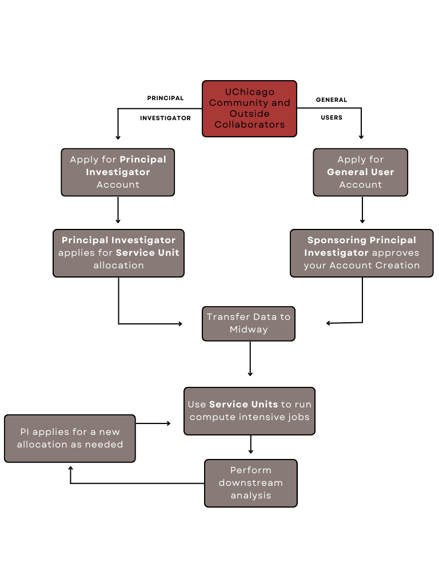

# How to Apply for an RCC Account

Discovering the world of high-performance computing at RCC is as easy as pie! We've streamlined the account application process into two main categories: Principal Investigator (PI) accounts and General User accounts. If you're a course instructor, we've got you covered with the option to apply for an Education account.

<p align="center">

</p> 

## Principal Investigator (PI) Accounts

Since October 2018, distinguished academics with titles like professor, associate professor, assistant professor, and more are eligible to dive into the wonders of RCC with a PI account.

* [Apply for an RCC PI account here.](https://rcc.uchicago.edu/accounts-allocations/pi-account-request){:target='_blank'}
* [Check eligibility criteria for University of Chicago Principal Investigators here.](https://ura.uchicago.edu/page/principal-investigator-eligibility){:target='_blank'}

## General User Accounts

Everyone else, from graduate students to external collaborators, can grab an RCC general user account. Just keep in mind, a PI with an active RCC account must be your sponsor.

* [Apply for an RCC general user account here.](https://rcc.uchicago.edu/accounts-allocations/general-user-account-request){:target='_blank'}

## Education Accounts

Instructors aiming to bring the power of RCC clusters to their courses can apply for an RCC Education account quarterly using the provided form.

* [Apply for an RCC education account here.](https://rcc.uchicago.edu/accounts-allocations/education-allocation-request){:target='_blank'}

Note: Instructors can request to carry course materials over to the next quarter or academic year by contacting [help@rcc.uchicago.edu](mailto:help@rcc.uchicago.edu){:target='_blank'}.

---

# Accounts FAQ

## New RCC users 

### How do I become an RCC user?

Submitting RCC user account requests is a breeze using our online application forms. Get all the details at [RCC Account Request](https://rcc.uchicago.edu/accounts-allocations/request-account){:target='_blank'}.

### How do I request access to a PI’s RCC resources?

Simply submit a [user account request](https://rcc.uchicago.edu/accounts-allocations/general-user-account-request){:target='_blank'} with your CNetID and the PI Account name. The PI will get an automated email for authorization.

### What is my RCC username and password?

Your RCC credentials are the same as your University of Chicago CNetID. Once your RCC account is ready, your username and password will match your CNetID credentials. 

### Can an external collaborator get a CNetID?

Absolutely! RCC can create CNetIDs for external collaborators. Dig into the details at [RCC Account Request](https://rcc.uchicago.edu/accounts-allocations/request-account){:target='_blank'}.

### How do I access RCC systems?

Accessing RCC systems is a multi-faceted journey. Use an SSH client with enabled X11 forwarding or ThinLinc (remote desktop) for interactive access. Explore more details on [Accessing RCC resources](connecting.md). For file access, employ SCP, Globus Online, or SAMBA.

## Current RCC users 

### How do I change/reset my password?

UChicago IT services handle CNetID passwords. For changes or resets, reach out to IT services.

### Multiple affiliations

Embrace multiple affiliations! Both general users and PIs can join multiple pi-accounts by submitting a [general user account request](https://rcc.uchicago.edu/accounts-allocations/general-user-account-request){:target='_blank'}. No need to fret about losing memberships; it's all about expanding possibilities.

### What groups am I a member of?

To explore your group memberships, log into any Midway ecosystems login nodes through `SSH` and type `groups`.

## Leaving UChicago 

### What if my CNetID password doesn't work after leaving the university?

If you've left the university and can't log in, contact our Help Desk to request re-enabling access to your account.  To reenable your CNetID, you will need to request an [RCC account extension](https://rcc.uchicago.edu/accounts-allocations/account-extension-request){:target='_blank'}.  

### Will I still have access to my RCC account after leaving the University?

Typically, UChicago IT will terminate your CNetID a few months after you leave. To keey using Midway clusters, request an [RCC account extension](https://rcc.uchicago.edu/accounts-allocations/account-extension-request){:target='_blank'}.

### What to Do After Completing a Project

Once your project is complete, it's essential to ensure smooth handover and file management. Follow these steps:

1. **Grant Group Access**: Allow your group members access to your files using the following SSH command:

    ```bash
    chmod 2771 -R <your_folders>
    ```

    For example:

    ```bash
    chmod 2771 -R /project/drpepper/cell-tracker
    ```

    This command sets the appropriate permissions for your folders.

2. **Assign Group Ownership**: Ensure that your account's PI is the group owner of your files with:

    ```bash
    chgrp pi-drpepper -R <your_folders>
    ```

    For example:

    ```bash
    chgrp pi-drpepper -R /project/drpepper/cell-tracker
    ```

    This step facilitates proper file management within your research group.

---

Footnote: For an in-depth dive, visit the [accounts and allocations page on our main website](https://rcc.uchicago.edu/accounts-allocations){:target='_blank'}.