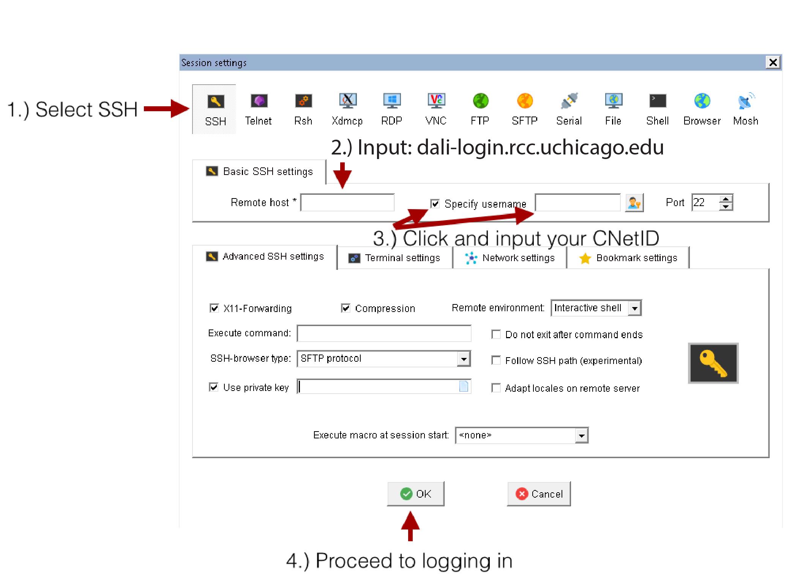

Connecting to DaLi

The information here describes how users can access RCC resources. All users of RCC resources are responsible for knowing and abiding by the <a class="reference external" href="https://rcc.uchicago.edu/about-rcc/rcc-user-policy">RCC User Policy</a>.

To use DaLi resources, you will need to have a Midway user account and will need to have an approval to access to your PI directory on DaLi. If you do not have a Midway user account, please see the <a class="reference external" href="https://rcc.uchicago.edu/getting-started">Getting Started</a> page for how to apply for an account. If you don't have a permission to access to your PI directory on DaLi, please submit a ticket to rt@rcc.uchicago.edu.

<div class="contents local topic" id="contents">
<ul class="simple">
<li><a class="reference internal" href="#account-credentials" id="id1">Account Credentials</a></li>
<li><a class="reference internal" href="#connecting-with-ssh" id="id2">Connecting with SSH</a><ul>
<li><a class="reference internal" href="#macintosh-linux-user-ssh-access" id="id3">Macintosh/Linux User SSH Access</a></li>
<li><a class="reference internal" href="#windows-user-ssh-access" id="id4">Windows User SSH Access</a></li>
</ul>
</div>

<div class="section" id="account-credentials">
<h2><a class="toc-backref" href="#id1">Account Credentials</a><a class="headerlink" href="#account-credentials" title="Permalink to this headline"></a></h2>
<p>In order to make use of resources provided by the Research Computing
Center you must first obtain a RCC user account. If you do not already
have a RCC acount, see the <a class="reference external" href="https://rcc.uchicago.edu/getting-started">Getting Started</a> page for more information
on obtaining a RCC account.</p>

<p>Your RCC account uses your UChicago CNetID for the username and
the corresponding CNetID password for the password:</p>

<div class="highlight-python"><div class="highlight">
<pre><span></span>Username: CNetID
Password: CNet password
</pre></div>
</div>

Please also note that you must have enabled<a class="reference external" href="https://2fa.rcc.uchicago.edu"> Two Factor Authentication</a> for your CNetID before connecting to DaLi.

<div class="section" id="connecting-with-ssh">
<h2><a class="toc-backref" href="#id2">Connecting with an SSH client</a><a class="headerlink" href="#connecting-with-ssh" title="Permalink to this headline"></a></h2>

<p>Secure Shell (SSH) is a protocol that provides secure command-line access to remote resources
such as DaLi or Midway2. By using SSH, you can remotely log in to your DaLi account and interact
with the DaLi high-performance compute cluster.</p>

<div class="section" id="macintosh-linux-user-ssh-access">
<h2><a class="toc-backref" href="#id3">Macintosh/Linux User SSH Access</a><a class="headerlink" href="#macintosh-linux-user-ssh-access" title="Permalink to this headline"></a></h2>

<p>Most Unix-like operating systems (Mac OS X, Linux, etc) provide an ssh
utility by default that can be accessed by typing the command
ssh in a terminal window. To log in to DaLi from a Linux or Mac computer, open a
terminal and at the command line enter:</p>

<div class="highlight-python">
<div class="highlight"><pre>
ssh CNetID@dali-login.rcc.uchicago.edu
</pre></div></div>

Provide your CNetID password when prompted for a password. A Duo two-factor autentication window will then pop up requesting you select from the available 2FA options to authenticate to DaLi:<br><br> <br><br>

<p> **Note** SSH key-based authentication is no longer supported. The SSH password-based authentication is currently the only supported method for authentication.</p>

Choose from the available two-factor authentication options and finish the authentication process.

To enable X11 forwarding when connecting to DaLi with ssh, the -Y flag should be included.

```
ssh -Y CNetID@dali-login.rcc.uchicago.edu
```

<p> **Note** <a class="reference external" href="https://www.xquartz.org">XQuartz</a> is required to enable trusted X11 forwarding on a Mac.</p>

<div class="section" id="windows-user-ssh-access"><h2><a class="toc-backref" href="#id4">Windows User SSH Access</a><a class="headerlink" href="#macintosh-linux-user-ssh-access" title="Permalink to this headline"></a></h2>

Windows users running Windows 10’s April 2018 release will have ssh enabled from the Powershell by default. All other Windows users will first need to download an ssh client to interact with the remote Unix command line. We recommend the <a class="reference external" href="https://mobaxterm.mobatek.net">MobaXterm</a>, client, although other options are available. Once the MobaXterm client is installed on your local machine, open the MobaXterm client and click on the Sessions icon at the upper left hand corner of the client. Then perform the following numbered steps, illustrated in the figure below, to establish a connection to DaLi.

1.	Click the SSH tab to expand the SSH login options.

2.	In the Remote host field input:

dali-login.rcc.uchicago.edu (to connect to DaLi cluster)

1.	Select the Specify username button and input your CNetID

2.	Proceed to log in by clicking the OK button.

<br><br> <br><br>

Provide your CNetID password when prompted for a password. A Duo two-factor autentication window will then pop up requesting you select from the available 2FA options to authenticate to DaLi:<br><br> <br><br>

Choose from the available two-factor authentication options and finish the authentication process.
