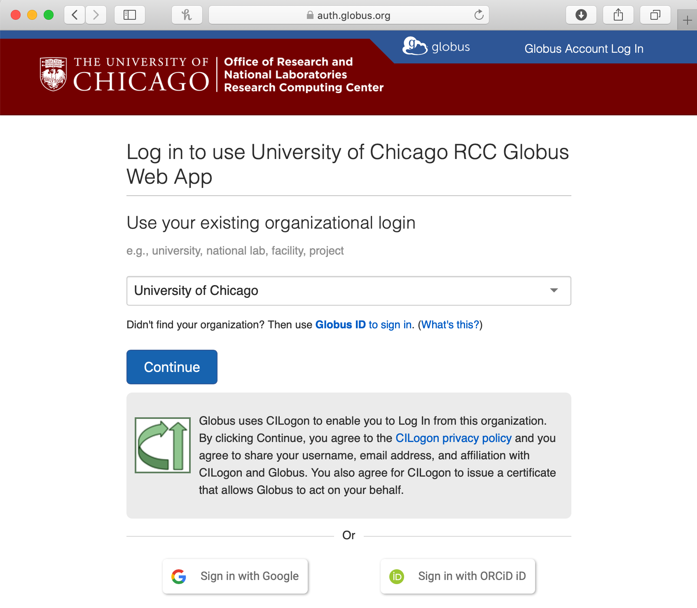
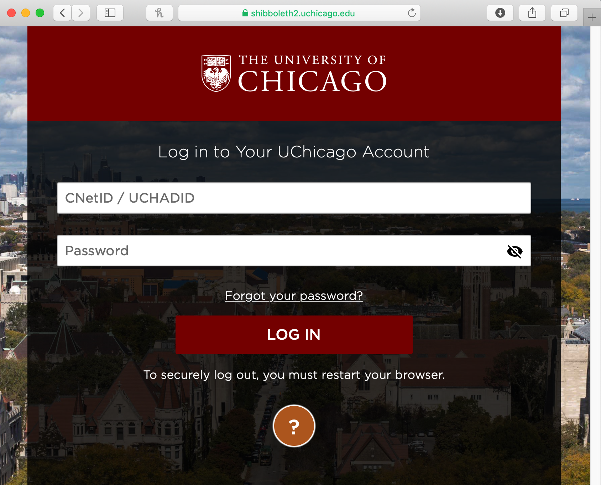
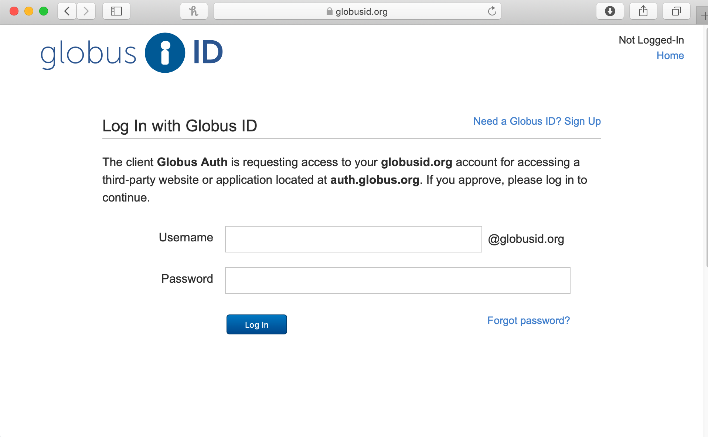
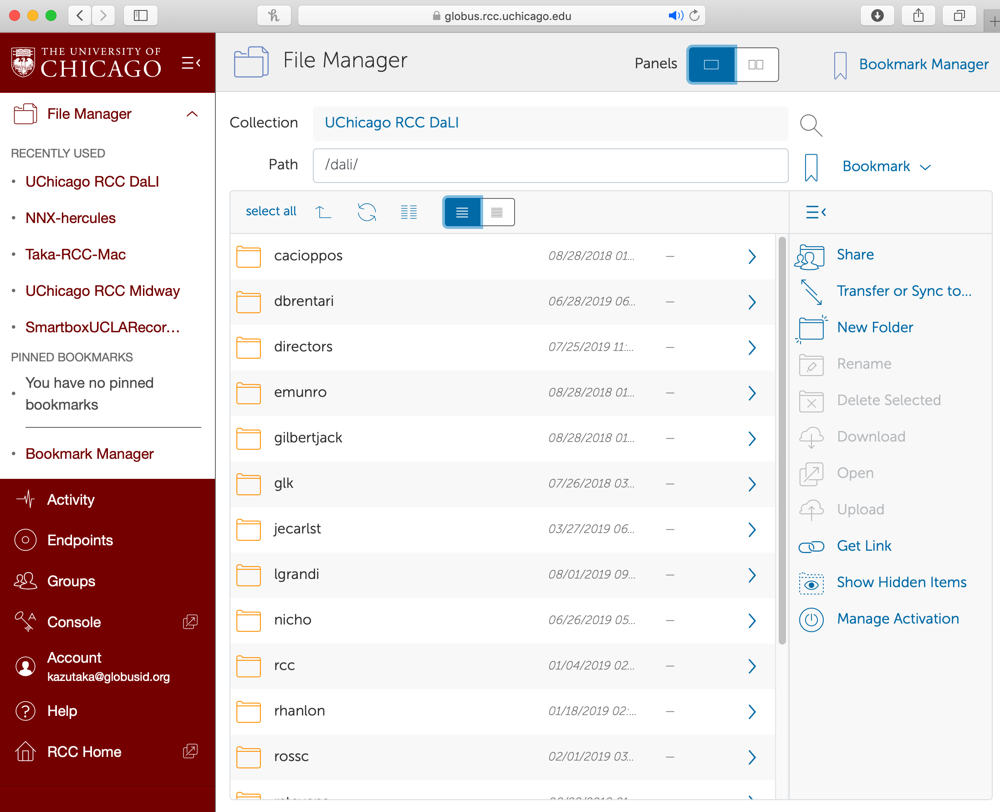
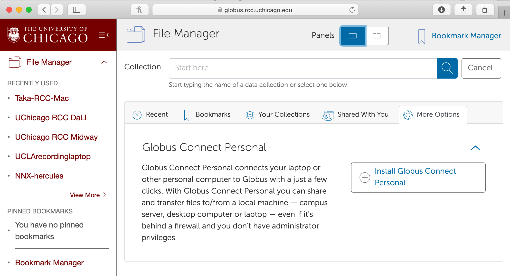

#Data Transfer to DaLI

RCC provides a number of methods for accessing and transferring data in/out of DaLi. We recommend the :command:`scp` protocol for transferring files to/from RCC systems. RCC hosts a managed Globus Online endpoint that can be used for moving very large amounts of data.

SCP
===

Secure copy or SCP is a means of securely transferring computer files between a local host and a remote host. It is based on the Secure Shell (SSH) and Secure File Transfer (SFTP) protocols.

Command-Line Operation
----------------------

Most UNIX-like operating systems (Mac OS X, Linux, etc) provide a:command:`scp` command which can be accessed from the command line. To transfer files from your local computer to your home directory on DaLI, open a terminal window and issue the command::

```
Single files: $ scp <some file> <CNetID>@dali-login.rcc.uchicago.edu:
Directories:  $ scp -r <some dir> <CNetID>@dali-login.rcc.uchicago.edu:
```

When prompted, enter your CNet password.

WinSCP GUI for Windows Clients
------------------------------

WinSCP is a scp client software that can be used to move files to and from DaLI and a Windows machine. WinSCP can be obtained from http://www.winscp.net.

When setting up your connection to DaLI in WinSCP, use the following information::

```
Hostname: dali-login.rcc.uchicago.edu
Port:     22
Username: CNetID
Password: CNet password
```

After connecting, if you are prompted to accept the server's host key, select "yes."

Upon successfully connecting, the main WinSCP window allows you to move files from your local machine (left side) to DaLI (right side).

Globus Online
=============

Globus Online is a robust tool for transferring large data files to/from DaLI. The RCC has a customized Globus Online login site at https://globus.rcc.uchicago.edu and uses Single Sign On capabilities of CILogon. If you have already signed up, here is the connection information::

```
URL:       https://globus.rcc.uchicago.edu
End Point: UChicago RCC DaLI
```

Follow these instructions to get started:

-	Go to https://globus.rcc.uchicago.edu and hit *Proceed*

-	Select "University of Chicago" for the Identity Provider



-	Enter your CNetID and password when prompted



-	You will need to link your University of Chicago credentials to a Globus Online account. Either create a new Globus Online account or sign in to your existing account if you have one.



-	Once you are signed in, enter `UChicago RCC DaLI` as the Endpoint and hit the Go button



-	If you want to transfer files from your local computer, click the *More Options* link on the File Manager page and follow the instructions in *Install Globus Connect Personal*.



There is extensive documentation on the Globus Online site as to how to transfer files in different modes. Please refer to their documentation for more details or contact us with any RCC specific issues.
