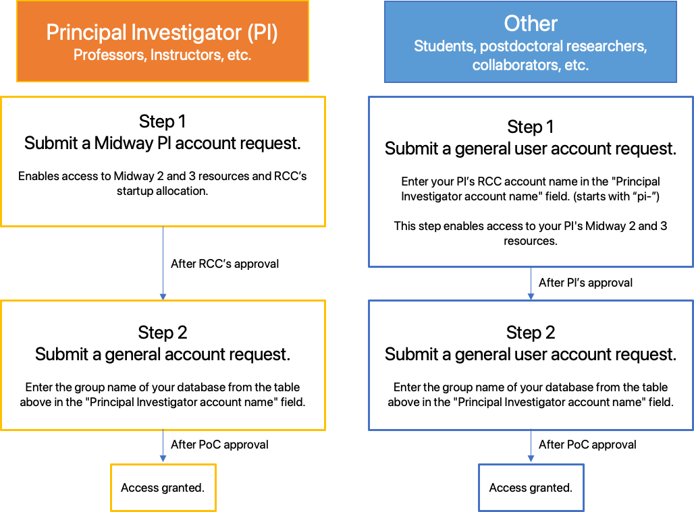

# BFI databases

List of BFI databases hosted on Midway2: 

|Database Name|Point of contact (PoC)|Group name|Directory|
|---|---|---|---|
|bfi-la_voters|||`/project2/databases/bfi/bfi-la_voters`|
|bfi-loan	|Colleen Reda (cmreda[@]uchicago.edu)|data-bfi-loan|`/project2/databases/bfi/bfi-loan`|
|bfi-tax_deed|Colleen Reda (cmreda[@]uchicago.edu)|data-bfi-tax_deed|`/project2/databases/bfi/bfi-tax_deed`|
|bfi-ushousehold|||`/project2/databases/bfi/bfi-ushousehold`|
|bfi-vgs|||`/project2/databases/bfi/bfi-vgs`| 
|bfi-data-voter|Rekaa Thiagarajan (rekaakt[@]uchicago[.]edu)|data-bfi-voter| `/project2/databases/bfi/bfi-data-voter` |

## Eligibility

* All University of Chicago faculty members (PIs) are eligible to request access to the BFI databases with approval from the designated point of contact (PoC) for the database.
* After the PI and database’s PoC approval have been received, students, post-doctoral researchers, and collaborators, among others, can access the databases. 

 

## Accessing databases

### Method 1: SMB - Shared Drive 

#### Microsoft Windows

 

On a Windows computer, select “Map Network Drive” and enter one of the following UNC paths depending on which database on Midway2 you wish to connect to, for example, `bfi-data-voter` here: 

`\\midwaysmb.rcc.uchicago.edu\project2\databases\bfi\bfi-data-voter`

Enter `ADLOCAL\{CNetID}` for the username and enter your CNetID password.

#### Apple macOS

 

On a macOS X computer, select “Connect to Server” (from the “Go” dropdown in Finder) and enter one of the following URLs depending on which database on Midway 2 you wish to connect to, for example, `bfi-data-voter` here:

`smb://midwaysmb.rcc.uchicago.edu/project2/databases/bfi/bfi-data-voter`

Enter `ADLOCAL\{CNetID}` for the username and enter your CNetID password.

### Method 2: Globus 
Follow the steps to connect to the Midway2 Globus endpoint [here](https://rcc-uchicago.github.io/user-guide/globus/). 

!!! note 
		Always use absolute paths to access databases, as users lack read permissions for parent directories for privacy reasons. 

### Method 3: SSH (SCP, SFTP, etc.) 
Follow the steps to connect to Midway2 through SSH [here](https://rcc-uchicago.github.io/user-guide/ssh/). 

!!! note 
		Always use absolute paths to access databases, as users lack read permissions for parent directories for privacy reasons. 

