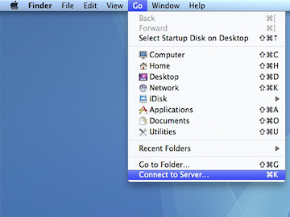

# Booth databases

List of Booth databases hosted on Midway2: 

|Database Name|Point of contact (PoC)|Group name|Directory|
|---|---|---|---|
| L2 Data Consumer | Jack Mountjoy (jack.mountjoy[@]chicagobooth[.]edu)| `l2-data-consumer` | `/project2/databases/booth/l2-data-consumer` |

## Eligibility

* All University of Chicago faculty members (PIs) are eligible to request access to the Booth databases with approval from the designated point of contact (PoC) for the database.
* After the PI and database’s PoC approval have been received, students, post-doctoral researchers, and collaborators, among others, can access the databases. 

 

* [PI account request form](https://rcc.uchicago.edu/accounts-allocations/pi-account-request) 
* [General user access request form
](https://rcc.uchicago.edu/accounts-allocations/general-user-account-request)

## Accessing databases

### Method 1: SMB - Shared Drive 

#### Microsoft Windows

 

On a Windows computer, select “Map Network Drive” and enter one of the following UNC paths depending on which database on Midway2 you wish to connect to, for example, `l2-data-voter` here: 

`\\midwaysmb.rcc.uchicago.edu\project2\databases\booth\l2-data-consumer`

Enter `ADLOCAL\{CNetID}` for the username and enter your CNetID password.

#### Apple macOS

 

On a macOS X computer, select “Connect to Server” (from the “Go” dropdown in Finder) and enter one of the following URLs depending on which database on Midway 2 you wish to connect to, for example, `l2-data-voter` here:

`smb://midwaysmb.rcc.uchicago.edu/project2/databases/booth/l2-data-consumer`

Enter `ADLOCAL\{CNetID}` for the username and enter your CNetID password.

### Method 2: Globus 
Follow the steps to connect to the Midway2 Globus endpoint [here](https://rcc-uchicago.github.io/user-guide/globus/). 

!!! note 
		Always use absolute paths to access databases, as users lack read permissions for parent directories for privacy reasons. 

### Method 3: SSH (SCP, SFTP, etc.) 
Follow the steps to connect to Midway2 through SSH [here](https://rcc-uchicago.github.io/user-guide/ssh/). 

!!! note 
		Always use absolute paths to access databases, as users lack read permissions for parent directories for privacy reasons. 
