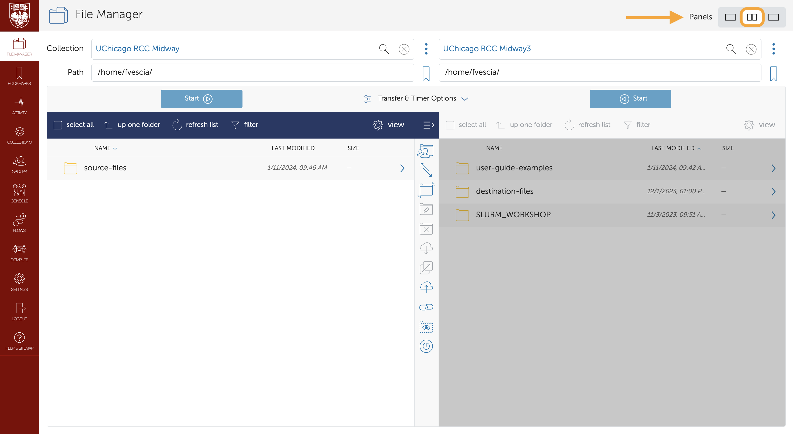

# Login to Globus & Browse Your Files

**Globus** is a robust file-sharing and transfer service. This guide explains how to use Globus to browse files you have stored in the RCC Midway 2 and 3 ecosystems. 

## Why Use Globus?

## Login to Globus

Go to <a href='https://globus.rcc.uchicago.edu' target='_blank'>globus.rcc.uchicago.edu</a>. Select "University of Chicago" from the drop-down list of existing organizational logins and click "Continue.":

If you are accessing Globus with your University of Chicago login for the first time, you will need to agree to the Globus Terms of Service and Privacy Policy:

If you are accessing Globus with your University of Chicago login for the first time, you will need to configure your Globus permissions:

## Browse Your Files

Once you have signed in, click the "File Manager" tab in the toolbar on the left of your screen and type "University of Chicago Research Computing Center" into the collection search bar. The RCC manages three Globus collections (also called endpoints):

### RCC-Managed Globus Collections

<table align="center" border="1" cellpadding="1" cellspacing="1" style="width:85%">
	<thead>
		<tr>
			<th scope="col">Collection name</th>
			<th scope="col">Description&nbsp;</th>
		</tr>
	</thead>
	<tbody>
		<tr>
			<td>UChicago RCC DaLI</td>
			<td>is a collection within the RCC&#39;s Midway2 ecosystem. It provides additional storage for PIs who contributed to the DaLI project.&nbsp;Selecting the DaLI collection, you land in Midway2&#39;s `/dali/` directory.</td>
		</tr>
		<tr>
			<td>UChicago RCC Midway</td>
			<td>houses files from the RCC&#39;s Midway2 ecosystem. When you select this collection, you land in your Midway2 home directory, `/home/`, denoted by a `/~/` path. Click up one folder to reach the top-level directory to access your scratch space and more.</td>
		</tr>
		<tr>
			<td>UChicago RCC Midway3</td>
			<td>houses files from the RCC&#39;s Midway3 ecosystem. When you select this collection, you land in your Midway3 home directory, `/home/`, denoted by a `/~/` path. Click up one folder to reach the top-level directory to access your scratch space and more.</td>
		</tr>
	</tbody>
</table>

To see files in different collections at the same time, click the two panes icon next to Panels in the upper-right corner. 

## Connecting

Midway clusters to your personal computer using Globus. See Transfer Files with Globus for help moving files between collections. This <a href='https://www.globus.org/globus-connect-personal' target='_blank'>guide</a> also describes how to make your computer a Globus endpoint so you can move files between your local system and RCC cluster (Midway2 and Midway3). In addition, you might find Globus documentation helpful if you need to schedule transfer files <a href='https://docs.globus.org/' target='_blank'>here</a>.
