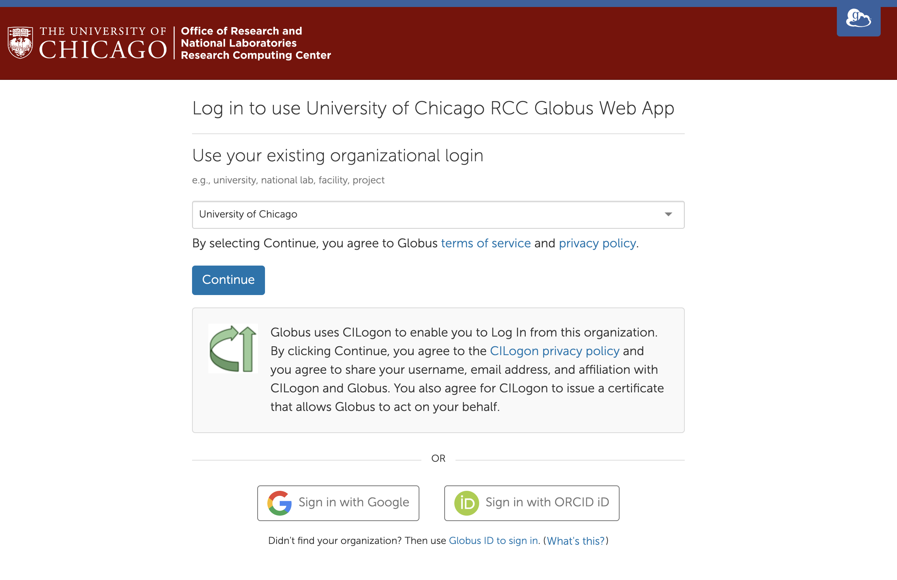
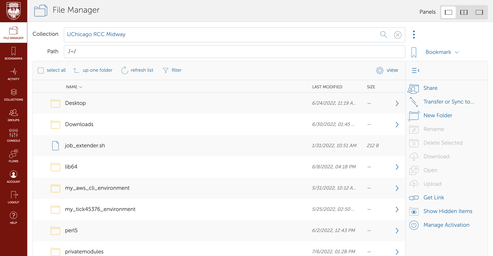

# Globus (Advance file transfer and sharing platform) 
Globus Online is a robust tool for transferring large data files to/from Midway. RCC has a customized Globus Online login site.

1. Go to [globus.rcc.uchicago.edu](https://globus.rcc.uchicago.edu) and Select “University of Chicago” for the existing organizational login:

    { width=1000 }

2. Enter your CNetID and password when prompted:

    { width=1000 }

3. You will need to link your University of Chicago credentials to a Globus Online account. Either create a new Globus Online account or sign in to your existing account if you have one.

4. Once you are signed in, select the "File Manager" tab on the sidebar, then enter "ucrcc#midway". You can select "UChicago RCC Midway" to access your Midway2 files or "UChicago RCC Midway3" to access your Midway3 files.

    { width=1000 }

5. You will then be able to perform actions such as transfer files, share collections, or create new directories. To learn more about how to use these tools, please refer to the "Help" tab on the left toolbar.

    { width=1000 }

There is extensive documentation on the [Globus Online](https://docs.globus.org/) site as to how to transfer files in different modes. Please refer to their documentation for more details or contact us with any RCC specific issues.