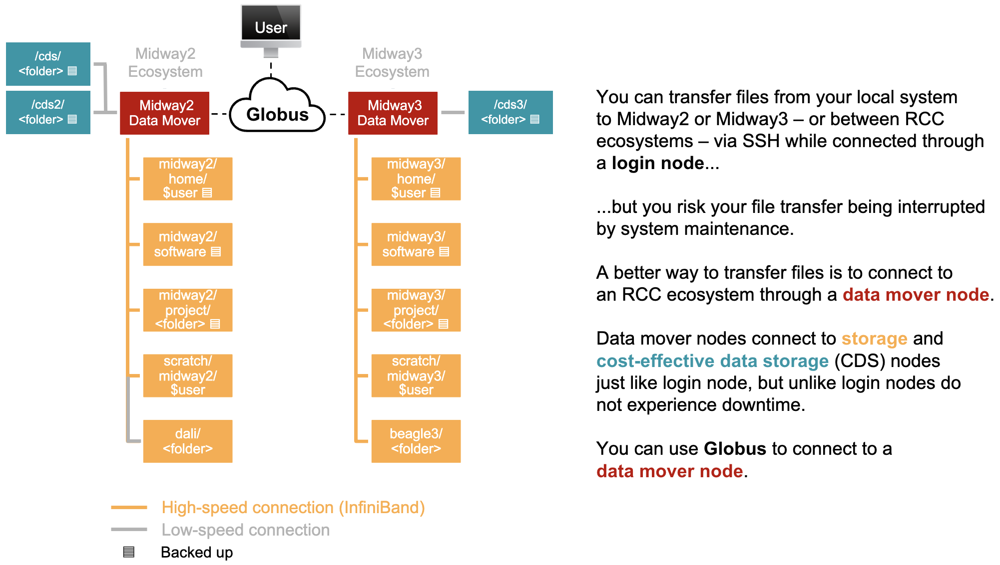

# Login to Globus & Browse Your Files

**Globus** is a robust file-sharing and transfer service. This guide explains how to use Globus to browse files you have stored in an RCC ecosystem (Midway2 or Midway3). Guides to making your computer a Globus endpoint (so you can transfer files between your local system and RCC ecosystems) and to scheduling data transfers with Globus are coming soon!

## Why Use Globus?

## Login to Globus

Go to [globus.rcc.uchicago.edu](). Select "University of Chicago" from the drop-down list of existing organizational logins and click "Continue.":

=======
<h1>Login to Globus &amp; Browse Your Files</h1>

<strong>Globus</strong>&nbsp;is a robust file-sharing and transfer service. This guide explains how to use Globus to browse files you have stored in an RCC Midway 2 and 3 ecosystems.

<h2>Why Use Globus?</h2>

<table align="center" border="1" cellpadding="1" cellspacing="1" style="width:650px">
	<tbody>
		<tr>
			<td></td>
		</tr>
	</tbody>
</table>

## Set Up Your Account

If you are accessing Globus with your University of Chicago login for the first time, you will need to set up your account. If your account is already set up, skip ahead to [Browse Your Files](##browse-your-files).

When you first log in, you will see an option to link your University of Chicago login to an existing Globus account. Click "Link to an existing account" if you have another Globus account. Otherwise click "Continue":

If you are accessing Globus with your University of Chicago login for the first time, you will need to agree to the Globus Terms of Service and Privacy Policy:

If you are accessing Globus with your University of Chicago login for the first time, you will need to configure your Globus permissions:

## Browse Your Files

Once you have signed in, click the "File Manager" tab in the toolbar on the left of your screen and type "University of Chicago Research Computing Center" into the collection search bar. The RCC manages three Globus collections (also called endpoints):

:::{.callout-note title="RCC-Managed Globus Collections"}
**DaLI** is a collection within the RCC's Midway2 ecosystem. It provides additional storage for PI's who contributed to the DaLI grant. When you select the DaLI collection, you land in Midway2's `/dali/` directory.

**Midway** houses files from the RCC's older ecosystem, Midway2.

**Midway3** houses files from the RCC's newer ecosystem, Midway3. 

When you select the **Midway** or **Midway3** collection, you land in your personal Midway2 or Midway3 home directory, `/home/<cnet-id>`, denoted by a `/~/` path. Click "up one folder" to reach the top-level directory, where you can access software, scratch space, and more.
:::

To see files in different collections at the same time, click the "two panes" icon next to "Panels" in the upper-right corner:

See Transfer Files with Globus for helping moving files between collections. The guide also describes how to make your computer a Globus endpoint, so you can move files between your local system and RCC ecosystems (Midway2 and Midway3)
=======

&nbsp;

You can transfer files from your local system to RCC clusters &ndash; or between RCC ecosystems &ndash; via SSH while connected through a login node. Still, you risk your file transfer being interrupted if your internet connection is unstable. ​A better way to transfer files is to connect to an RCC ecosystem through a data mover node.​ Data mover nodes connect to high-performance storage nodes and ​cost-effective data storage (CDS) nodes just like login nodes, but unlike login nodes, you can close a session anytime while your data transfer is happening in the background.​ Globus and Samba (SMB) are two ways to connect to a data mover node. Here, we cover Globus, which is much faster, more secure, and more stable.

<h2>Login to Globus</h2>

Go to <a href="http://globus.rcc.uchicago.edu">globus.rcc.uchicago.edu</a>. Select &quot;University of Chicago&quot; from the drop-down list of existing organizational logins and click &quot;Continue.&quot;:

<table align="center" border="1" cellpadding="1" cellspacing="1" style="width:650px">
	<tbody>
		<tr>
			<td></td>
		</tr>
	</tbody>
</table>

<em>The University of Chicago Globus landing page. &quot;University of Chicago&quot; is selected from the drop-down menu.</em>

Enter your CNetID and password when prompted:

<table align="center" border="1" cellpadding="1" cellspacing="1" style="width:650px">
	<tbody>
		<tr>
			<td></td>
		</tr>
	</tbody>
</table>

<em>The University of Chicago CNetID sign-in page.</em>

<h2>Set Up Your Account</h2>

If you are accessing Globus with your University of Chicago login for the first time, you will need to set up your account. If your account is already set up, skip ahead to the Browse Your Files section.

When you first log in, you will see an option to link your University of Chicago login to an existing Globus account. Click &quot;Link to an existing account&quot; if you have another Globus account. Otherwise, click &quot;Continue&quot;:

<table align="center" border="1" cellpadding="1" cellspacing="1" style="width:650px">
	<tbody>
		<tr>
			<td></td>
		</tr>
	</tbody>
</table>

A message on the University of Chicago Globus landing page: This is the first time you are accessing Globus with your University of Chicago login. If you have previously used Globus with another login, you can link it to your University of Chicago login. When linked, both logins will be able to access the same Globus account permissions and history.

If you are accessing Globus with your University of Chicago login for the first time, you will need to agree to the Globus Terms of Service and Privacy Policy:

<table align="center" border="1" cellpadding="1" cellspacing="1" style="width:650px">
	<tbody>
		<tr>
			<td></td>
		</tr>
	</tbody>
</table>

<em>A webpage that says &quot;Complete Your Sign Up.&quot; The box indicating the user has agreed to the Terms of Service and Privacy Policy is checked.</em>

If you are accessing Globus with your University of Chicago login for the first time, you will need to configure your Globus permissions:

<table align="center" border="1" cellpadding="1" cellspacing="1" style="width:650px">
	<tbody>
		<tr>
			<td></td>
		</tr>
	</tbody>
</table>

<em>A list of permissions the Globus Web App requests with options to allow or deny.</em>

<h2>Browse Your Files</h2>

Once you have signed in, click the &quot;File Manager&quot; tab in the toolbar on the left of your screen and type &quot;University of Chicago Research Computing Center&quot; into the collection search bar. The RCC manages three Globus collections (also called endpoints):

<table align="center" border="1" cellpadding="1" cellspacing="1" style="width:650px">
	<tbody>
		<tr>
			<td></td>
		</tr>
	</tbody>
</table>

<em>The Globus web app opens to the File Manager tab. &quot;University of Chicago Research Computing Center&quot; is typed into the collection search bar.</em>

<h3>RCC-Managed Globus Collections</h3>

<table align="center" border="1" cellpadding="1" cellspacing="1" style="width:85%">
	<thead>
		<tr>
			<th scope="col">Collection name</th>
			<th scope="col">Description&nbsp;</th>
		</tr>
	</thead>
	<tbody>
		<tr>
			<td>UChicago RCC DaLI</td>
			<td>is a collection within the RCC&#39;s Midway2 ecosystem. It provides additional storage for PIs who contributed to the DaLI project.&nbsp;Selecting the DaLI collection, you land in Midway2&#39;s `/dali/` directory.</td>
		</tr>
		<tr>
			<td>UChicago RCC Midway</td>
			<td>houses files from the RCC&#39;s Midway2 ecosystem.&nbsp;When you select this collection, you land in your Midway2 home directory, `/home/`, denoted by a `/~/` path. Click &quot;up one folder&quot; to reach the top-level directory to access your scratch space and more.</td>
		</tr>
		<tr>
			<td>UChicago RCC Midway3</td>
			<td>houses files from the RCC&#39;s Midway3 ecosystem.&nbsp;When you select this collection, you land in your&nbsp;Midway3 home directory, `/home/`, denoted by a `/~/` path. Click &quot;up one folder&quot; to reach the top-level directory to access your scratch space and more.</td>
		</tr>
	</tbody>
</table>

To see files in different collections at the same time, click the &quot;two panes&quot; icon next to &quot;Panels&quot; in the upper-right corner:&nbsp;

<table align="center" border="1" cellpadding="1" cellspacing="1" style="width:650px">
	<tbody>
		<tr>
			<td></td>
		</tr>
	</tbody>
</table>

<em>Globus File Manager in two-pane mode with Midway2 files in the left pane and Midway3 files in the right pane.</em>

<h2>Connecting</h2>

Midway clusters to your personal computer using Globus. See Transfer Files with Globus for help moving files between collections. This <a href="https://www.globus.org/globus-connect-personal">guide</a>&nbsp;also describes how to make your computer a Globus endpoint so you can move files between your local system and RCC cluster (Midway2 and Midway3). In addition, you might find Globus documentation helpful if you need to schedule transfer files <a href="https://docs.globus.org/">here</a>.&nbsp;

