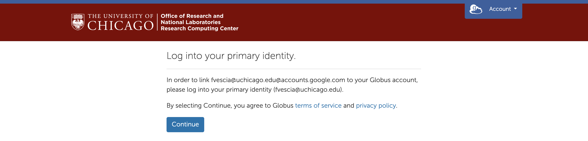

# Syncing Globus with UChicago Cloud Storage

**Globus** is a robust file-sharing and transfer service. This page explains how to sync Globus with University of Chicago cloud storage so you can use Globus features, like <a href='./globus/transfer-files/#Schedule-a-File-Transfer'>scheduled file transfers</a>, with files stored in your UChicago **Box**, **Google Drive**, and **OneDrive** accounts.

Globus calls a collection of files an endpoint. UChicago has Globus endpoints for Box, Google Drive, and OneDrive. By connecting to these endpoints, you can access files stored in your UChicago Box, Google Drive, and OneDrive accounts through Globus.

Start by logging into the <a href='https://globus.rcc.uchicago.edu/' target='_blank'>Globus Web App</a> with your CNet ID. Go into the File Manager and search for the endpoint for your cloud platform of choice using the Collection search bar:

Globus Staff GCSv5.4 Demo **Box (UChicago)**  
Globus Staff GCSv5.4 Demo **Google Drive**  
Globus Staff GCSv5.4 Demo **OneDrive** 

!!! note
	When you search for an endpoint, several options with similar names may appear. Make sure to choose the endpoint that matches the text here *exactly.* For example, choose Globus Staff GCSv5.4 Demo Google Drive, not Globus Staff GCSv5.4 Demo Google Drive HA.

When you choose a UChicago cloud storage endpoint, you will need to give Globus permission to access files you have stored on that cloud platform. For example, if you choose the Globus Staff GCSv5.4 Demo Google Drive endpoint, you will see a message like this:

When you click "Continue," Globus will route you to an identity verification page. Click "Globus Staff (globus.org)" to proceed:

When you click "Globus Staff (globus.org)," Globus will route you to the Google sign-in page. Choose the Google account associated with the files you would like to access through Globus:

When you click your Google account, you will return to globus.org, where you will be asked to log into your primary identity. Click "Continue" to proceed:

