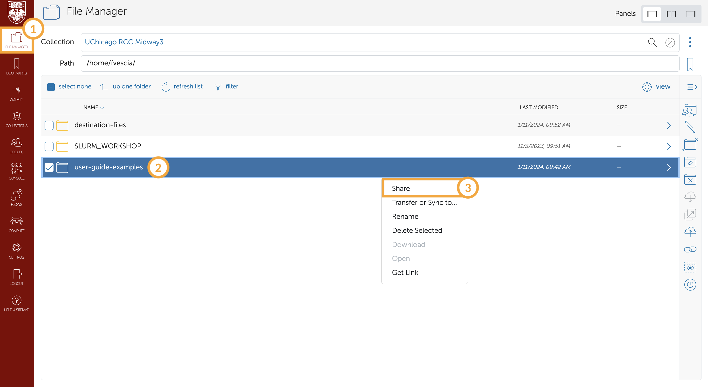
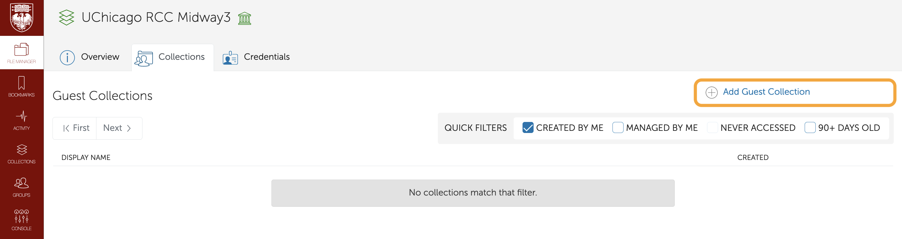
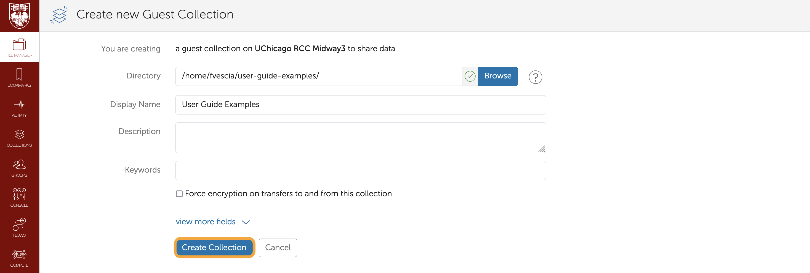
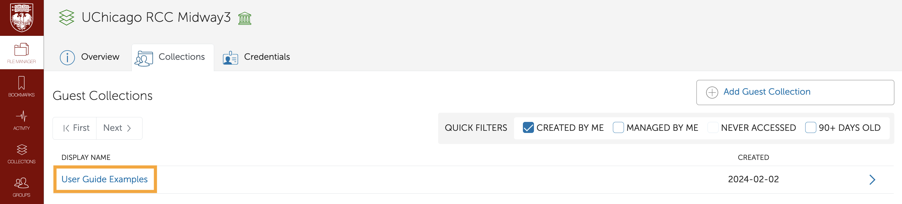
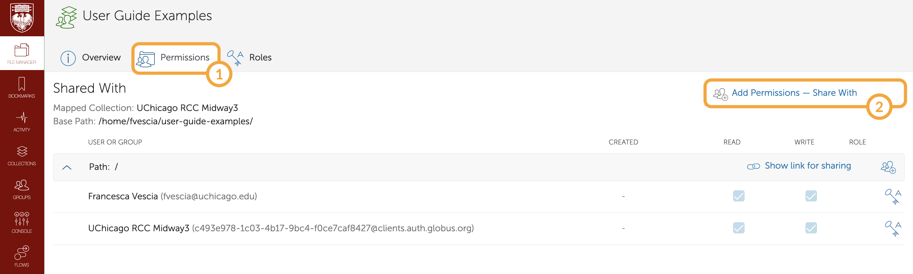
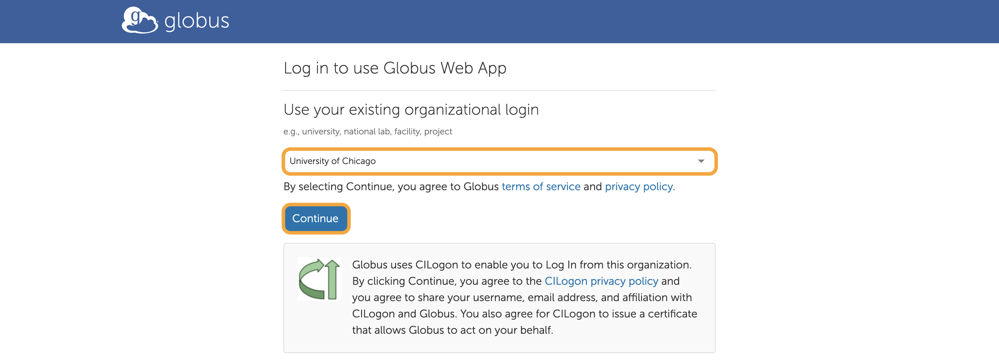
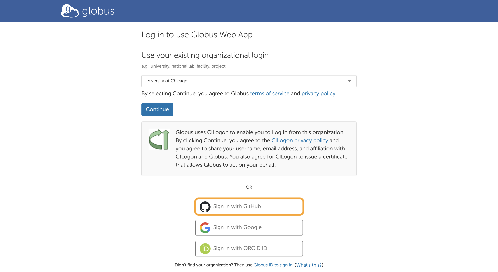
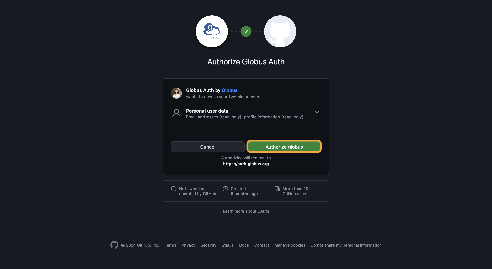
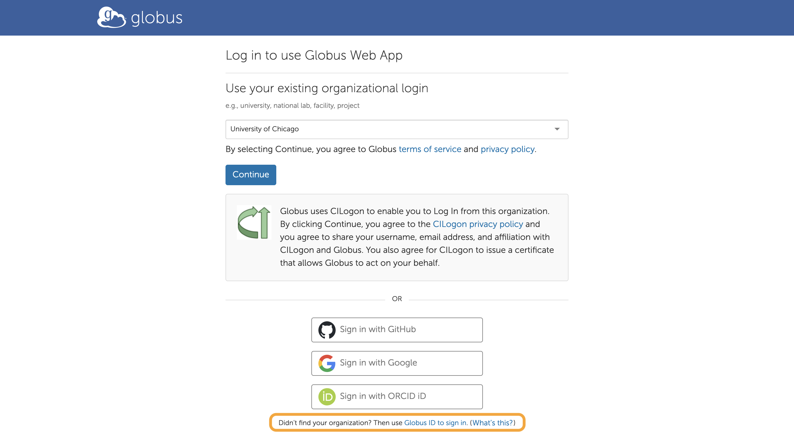
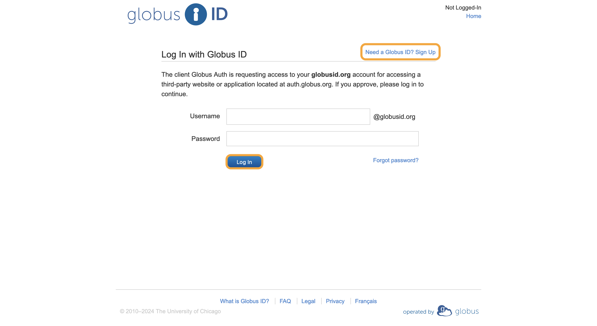

# Share Files with Globus

**Globus** is a robust file-sharing and transfer service. Other sections of this user guide detail how to <a href='./globus/access-files.md'>browse files with Globus</a> and <a href='./globus/transfer-files.md>move files between different Globus endpoints</a>. This page explains how to share files with external collaborators via Globus. (Anyone who belongs to your RCC group already has file access via the group's <a href='../storage/main.md#High-Performance-Storage/Research-Space'>project directories</a>.) Your external collaborators will each need their own Globus login, which they have several options for creating. Alternatively, you can sync Globus with Box, Google Drive, or OneDrive. If you share files this way, your external collaborators will not need to login to Globus.

## Select Files to Share
Go to the "File Manager" tab of the <a href='https://globus.rcc.uchicago.edu/' target='_blank'>Globus Web App</a>. Navigate to the folder that houses the files you want to share (<a href='./access-files.md#Browse-Your-Files'>read more about browsing files here</a>), right-click it, and select "Share" from the menu that appears:

## Create a Collection
If the files you have selected are not already part of a Guest Collection, you will see a message that "No collections match that filter." Click "Add Guest Collection" in the upper-right corner to create a collection of your selected files to share with external collaborators:

The Directory field will default to the folder that houses the files you have selected to share. Fill in the Display Name field and any other fields you like, then click "Create Collection":

The Filer Manager will open to the Permissions tab of your new collection, which you can now share.

## Share a Collection
If the files you have selected are already part of a Guest Collection, click the collection name:

The File Manager will open to an overview of the collection. Click "Permissions" in the upper-left menu bar, then click "Add Permissions – Share With" in the upper-right corner:

The `/` in the Path field indicates you are in the top-level directory of a collection. If you only want to grant permissions for a sub-directory, click "Browse" to navigate into the sub-directory you want to share. Enter your collaborator's Globus username or search for them via email. If they do not already have a Globus login, they can follow the steps below to create one.

## Globus Login Options for External Collaborators

External collaborators can login to Globus through the <a href='https://app.globus.org/' target='_blank'>Globus Web App</a>. They can login with an organizational login, GitHub account, Google account, ORCID iD, or Globus ID.

If your collaborator's university or lab uses Globus, they can select their organization from the drop-down menu and click "Continue" to login with their existing **organizational credentials** (their equivalent of a CNet ID):

Alternatively, your collaborator can login with an existing **GitHub, Google, or ORCID** account. If they click the button corresponding to their preferred platform, they will be prompted to login through that platform. For example, if they click "Sign in with GitHub," they will be redirected to GitHub, where they can authorize Globus to use their GitHub login:

Finally, if your external collaborator prefers not to use an existing login (e.g., university, lab, GitHub), they can create a **Globus ID** and use that to login. If they click "use Globus ID to sign in" at the bottom of the Globus Web App home page, they will be prompted to enter their Globus ID or create one if needed:

