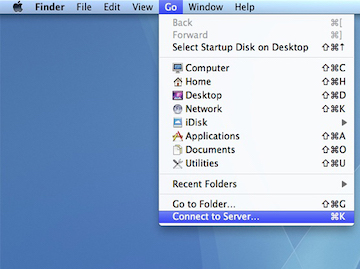

# Transferring Data to Midway

This page provides information on how to transfer data to Midway from your local computer (and vice versa).

Note that there are multiple ways to transfer data to Midway. SCP is generally preferred. SAMBA is useful for its ease of use, but is not suited for large file transfers. Globus Online provides robust support for transfers of large size and multiple files/directories.   
**[ Better to have a summary table here comparing different methods]**

## Secure Copy (SCP)

Most UNIX-like operating systems (Mac OS X, Linux, etc) provide a scp command which can be accessed from the command line. To transfer files from your local computer to your home directory (see [Data Storage](/docs/datastorage.md) for information on directories), open a terminal window and issue the command:  

For single files:
=== "Midway2"
    ```
    scp <some file> <CNetID>@midway2.rcc.uchicago.edu:
    ```
=== "Midway3"
    ```
    scp <some file> <CNetID>@midway3.rcc.uchicago.edu:
    ```
For directories:
=== "Midway2"
    ```
    scp -r <some dir> <CNetID>@midway2.rcc.uchicago.edu:
    ```
=== "Midway3"
    ```
    scp -r <some dir> <CNetID>@midway3.rcc.uchicago.edu:
    ```

To transfer to a directory **other than** your home directory (for example, project):

=== "Midway2"
    ```
    scp -r <some dir> <CNetID>@midway2.rcc.uchicago.edu:/project2
    ```
=== "Midway3"
    ```
    scp -r <some dir> <CNetID>@midway3.rcc.uchicago.edu:/project
    ```

When prompted, enter your CNet password.

## SAMBA

SAMBA allows us to connect to (or “mount”) their home and project directories on their local computer so that the file system on Midway2 appears as if it were directly connected to the local machine.   

This method of accessing your RCC home and project space is only available from within the UChicago campus network. From off-campus you will need to first **connect through the UChicago VPN.**

**Connecting from Windows**   


On a Windows computer, select “Map Network Drive” and enter one of the following UNC paths depending on which location on Midway you wish to connect to:  
=== "Midway2"
    === "Home"
        ```
        \\midwaysmb.rcc.uchicago.edu\homes
        ```
    === "Project2"
        ```
        \\midwaysmb.rcc.uchicago.edu\project2
        ```
    === "Scratch"
        ```
        \\midwaysmb.rcc.uchicago.edu\midway2-scratch
        ```
=== "Midway3"
    === "Home"
        ```
        \\midway3smb.rcc.uchicago.edu\homes
        ``` 
    === "Project"
        ```
        \\midway3smb.rcc.uchicago.edu\project
        ```
    === "Scratch"
        ```
        \\midway3smb.rcc.uchicago.edu\midway3-scratch
        ```

Enter `ADLOCAL\CNetID` for the username and enter your CNet password.  


**Connecting from Mac OS X**   

  

On a Mac OS X computer, select “Connect to Server” (from "Go" dropdown in Finder) and enter one of the following URLs depending on which location on Midway you wish to connect to:  

=== "Midway2"
    === "Home"
        ```
        smb://midwaysmb.rcc.uchicago.edu/homes
        ```
    === "Project2"
        ```
        smb://midwaysmb.rcc.uchicago.edu/project2
        ```
    === "Scratch"
        ```
        smb://midwaysmb.rcc.uchicago.edu/midway2-scratch
        ```
=== "Midway3"
    === "Home"
        ```
        smb://midway3smb.rcc.uchicago.edu/homes
        ``` 
    === "Project"
        ```
        smb://midway3smb.rcc.uchicago.edu/project
        ```
    === "Scratch"
        ```
        smb://midway3smb.rcc.uchicago.edu/midway3-scratch
        ```
Enter `ADLOCAL\CNetID` for the username and enter your CNet password.  


## HTTP (web browser)

## Globus Online
