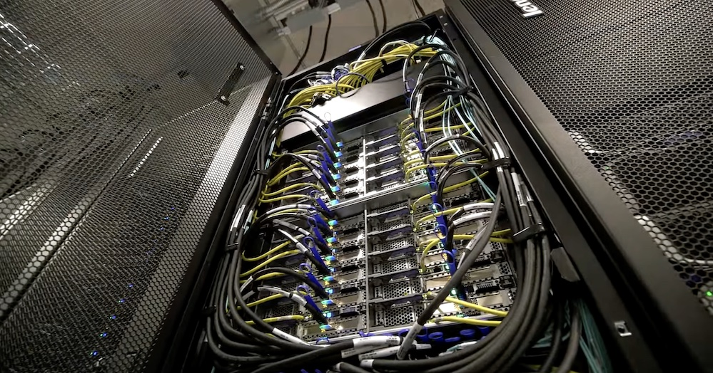

# Hardware Overview

<!-- From these links:
https://mdw3-docs.rcc.uchicago.edu/ -->
## Midway3 HPC Cluster
XXX total nodes with YYY compute cores yielding ZZZ Tera/Petaflops. 

### Operating System and Connectivity

Midway3 runs CentOs X, and all nodes are connected via Infiniband.

### Standard Compute Nodes Nodes

* XXX compute nodes, each equipped with:
    * 4 Intel Cascade Lake CPUs (xxx cores)
    * XX Local SSD Storage 
    * XX Memory 
* XX AMD compute nodes, with same specification, except 

### Specialized Nodes

#### GPU Nodes
There are 11 GPU nodes that are part of the Midway3 communal resources. Each GPU node has the Standard Intel Compute Node specifications and the following GPU configurations:

- 5 GPU nodes w/ 4x NVIDIA V100 GPUs per node
- 5 GPU nodes w/ 4x NVIDIA Quadro RTX 6000 GPUs per node
- 1 GPU node w/ 4x NVIDIA A100 GPUs per node

#### Big Memory Nodes
There are 2 big memory nodes available to all users. The big memory node has the Standard Intel Compute Node specifications, but with the following larger memory configurations:

- 1 nodes w/ 768 GB of memory
- 1 nodes w/ 1.52 TB of memory

## Midway2 HPC Cluster
XXX total nodes with YYY compute cores yielding ZZZ Tera/Petaflops. 
<!-- From these links:
https://rcc.uchicago.edu/resources/ 
https://rcc.uchicago.edu/support-and-services/midway2
-->

### Operating System and Connectivity

Midway2 runs CentOs X, and all nodes are connected via Infiniband.

### Standard Compute Nodes

* 210 compute nodes, each equipped with:
    * 4 Intel Broadwell CPUs (xxx cores)
    * XX Local SSD Storage 
    * XX Memory 

### Specialized Nodes

#### GPU Nodes
There are 4 GPU nodes that are part of the Midway2 communal resources. Each GPU node has the Standard Intel Compute Node specifications and the following GPU configurations:

- XX GPU nodes w/ 4x NVIDIA K80 GPUs

#### Big Memory Nodes
There is 1 big memory node available to all users. The big memory node has the Standard Intel Compute Node specifications, but with the following larger memory configurations:

- 1 node w/ 512 GB of memory
