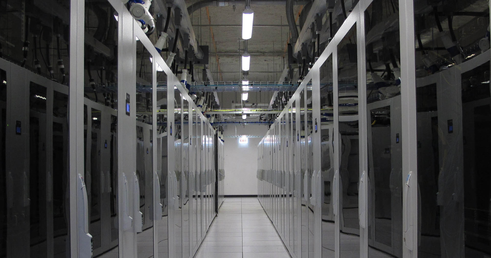

# Hardware Overview

This page provides technical details about the Midway2 and Midway3 compute clusters.

===  "Midway2"
    <!-- From these links:
    https://rcc.uchicago.edu/resources/ 
    https://rcc.uchicago.edu/support-and-services/midway2
    -->

    
    ##Midway2

    A professionally-managed high performance computing cluster forms the second generation core of RCC’s advanced computational infrastructure.

    The key features of the Midway 2 hardware are listed as follows:
    
    - 572 nodes total (16,016 cores)
    - 210 standard compute nodes
    - 4 NVIDIA K80 GPUs
    - Total of 2.2 PB SSD local disk
    - Operating System throughout cluster is Centos 8
    - Large shared memory nodes—up to 1TB of memory per node with either 16, 28, or 32 Intel CPU cores

    ### GPU Nodes
    { align=right width="150"}
    There are 4 GPU nodes that are part of the Midway2 communal resources. Each GPU node has the Standard Intel Compute Node specifications and the following GPU configurations:

    - 1 GPU node w/ 4x NVIDIA K80 GPUs

    ### Big Memory Nodes
    There is 1 big memory node available to all users. The big memory node has the Standard Intel Compute Node specifications, but with the following larger memory configurations:

    - 1 node w/ 512 GB of memory

=== "Midway3"
    <!-- From these links:
    https://mdw3-docs.rcc.uchicago.edu/ -->

    
    ##Midway3
    
    The latest high performance computing cluster built, deployed and maintained by RCC.

    At this time, only the Intel specific resources are made available. The key features of the Midway3 Intel hardware are listed as follows:

    - 220 nodes total (10,560 cores)
    - 210 standard compute nodes
    - 2 big memory nodes (1x768GB and 1x1.52TB)
    - 11 GPU nodes
    - All nodes have HDR InfiniBand (100 Gbps) network cards.
    - Each node has 960 GB SSD local disk
    - Operating System throughout cluster is Centos 8

    ### GPU Nodes
    There are 11 GPU nodes that are part of the Midway3 communal resources. Each GPU node has the Standard Intel Compute Node specifications and the following GPU configurations:

    - 5 GPU nodes w/ 4x NVIDIA V100 GPUs per node
    - 5 GPU nodes w/ 4x NVIDIA Quadro RTX 6000 GPUs per node
    - 1 GPU node w/ 4x NVIDIA A100 GPUs per node
    
    { width="150"}
    { width="150"}
    { width="100"}
    
    
    
    ### Big Memory Nodes
    There are 2 big memory nodes available to all users. The big memory node has the Standard Intel Compute Node specifications, but with the following larger memory configurations:

    - 1 nodes w/ 768 GB of memory
    - 1 nodes w/ 1.52 TB of memory
