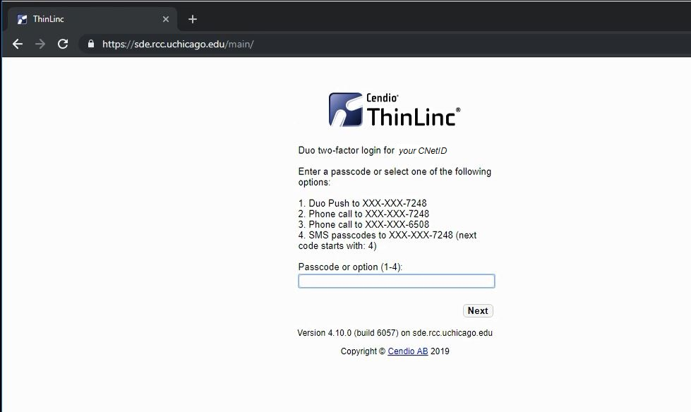
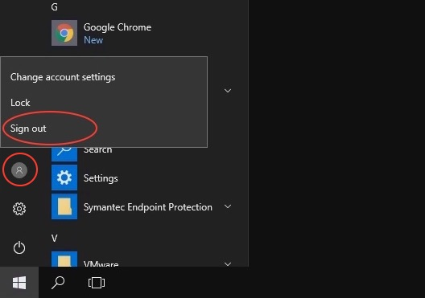

## Accessing MidwayR

To use MidwayR resources, you will need to have a MidwayR user account. If you do
not have a MidwayR user account, please see the Getting Started section for how to apply for an account.

> **Note** Although both Midway and MidwayR use CNetID for authentication, they do not share the accounts. 
  In other words, if you already have an account on Midway, you will still need to apply for an 
  account on MidwayR to be able to use MidwayR resources.   

Please also note that you must have enabled 
<a href="https://2fa.rcc.uchicago.edu" target="_blank">Two Factor Authentication</a>
for your CNetID before connecting to MidwayR.

Accessing MidwayR is a two-step process:

1. Login to Secure Data Enclave (SDE) Desktop using the Virtual Desktop
Infrastructure (VDI) client.

2. Once you are connected to the SDE Desktop, login to MidwayR using
ThinLinc or an SSH client.

### Connecting to the SDE Desktop

To connect to the SDE Desktop, you will need to download and install
the VDI client on your computer. The VDI client, "VMware Horizon", can
be downloaded from [here][vdi]. Note that you will need to be
connected to the University of Chicago VPN (see below) to access this
software.

Once you have installed the VDI client on your computer, connect to
the SDE Desktop by taking the following steps:

1. Login to the University of Chicago VPN (see [here][vpn] for
details). (**Note:** you need to use VPN regardless of whether you are
connecting from the campus network or not.)

2. Start up the VDI client on your computer.

3. If you are connecting to the SDE Desktop for the first time, add a
new server by double-clicking on the "Add Server" or "New Server"
button, which should appear on the screen as a button with a plus sign
(+). Enter `vdesk-sde.uchicago.edu` as the name of the Connection
Server, then click the "Connect" button (note that your screen may
look slightly different than what is shown here):  

  

4. Enter your user name (your CNetID), enter your password, set the
domain to "ADLOCAL", then clik the "Login" button:  

  

5. Double-click on the "Secure Data Enclave" icon and you will enter
to the SDE environment:  

At this point, you should be logged in to the SDE environment.

### Connecting to MidwayR

Once you are connected to the SDE environment using the VDI client
following the steps given above, please follow one of the methods below
to connect to MidwayR from the SDE environment.

#### Connecting with ThinLinc

ThinLinc is a remote desktop server application. It is recommended to
use ThinLinc when you run a software that requires a graphical user
interface, or "GUI" (e.g., Stata, MATLAB). To use ThinLinc to connect
to MidwayR, please take the following steps:

1. Open a browser (Chrome or Firefox) and enter
   `https://sde.rcc.uchicago.edu` in the address bar.

2. Enter your CNetID and password on the ThinLinc login page:  

  

3. Follow the two factor authentication prompts:  

  

4. If the login process is successful, you will see a Linux desktop
environment. To access the command-line shell, select the Applications
menu, then the Terminal icon:  

  

5. After selecting the Terminal icon, you should see a Terminal window
appear. Typically this will give a console prompt showing which login
node you are connected to, either `sde-login1` or
`sde-login2`:  

  

To exit ThinLinc, type `exit` in any Terminal window, select the
top-right icon, then select the "Log Out" menu item and follow
the instructions. Finally, close the browser window.  
   

#### Connecting with an SSH client

1. Launch PuTTY from the Windows Start Menu:  

  

2. Enter `midwayr.rcc.uchicago.edu` as the server name and click on
the "Open" button:  
  

3. If you are connecting to MidwayR for the first time, you will be
asked to create a new SSH key. Click the "Yes" button, which will save
the server host key:  
  

4. Next, enter your CnetID and password. (There should be no
additional two-factor authentication at this step.)

At this point, if you successfully passed the password 
authentication step, you should be connected to one of the MidwayR
login nodes, either `sde-login1` or `sde-login2`. Please read the
other sections of the MidwayR User Guide to learn more about how to
use the MidwayR computing environment.

To close your MidwayR connection in PuTTy, type `exit`.

## Disconnecting from MidwayR

Once you are done using MidwayR, be sure to logout of your
session. Like connecting, disconnecting is a two-step process: first,
exit from ThinLinc or PuTTY (see above); second, logout from the SDE
environment by selecting "Sign out" from the Windows Start Menu:

[vdi]: https://vdesk-sde.uchicago.edu
[vpn]: https://uchicago.service-now.com/it?id=kb_article&kb=kb00015292
