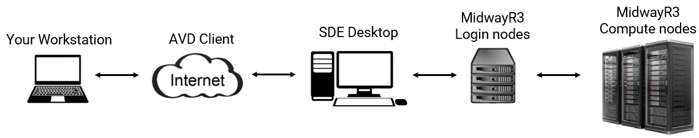
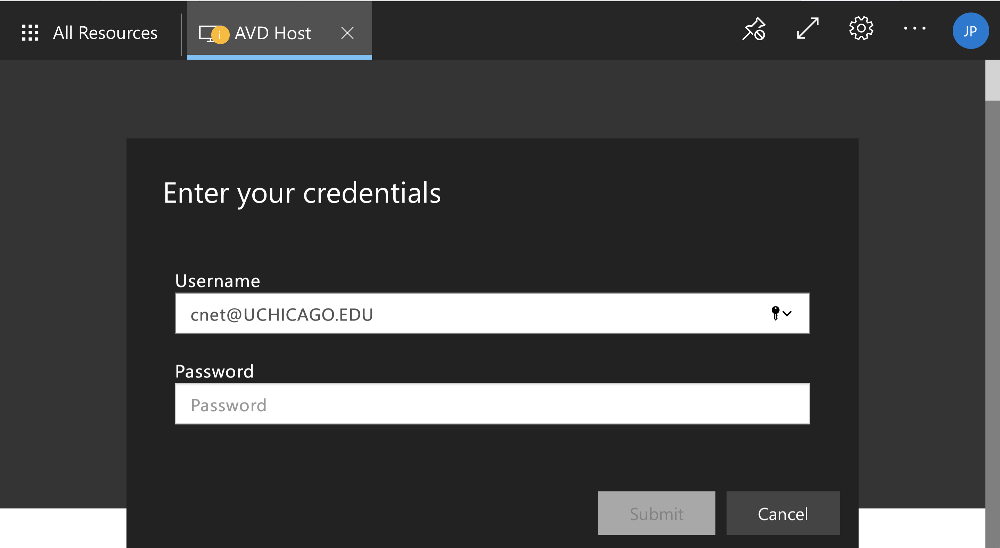
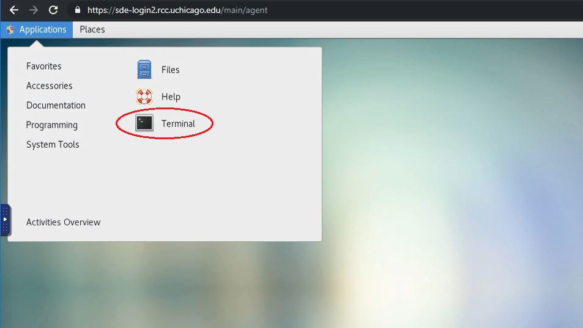
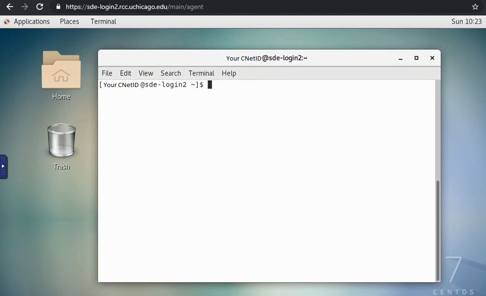

## Quick Overview:
Because MidwayR3 has no connection to the Internet, accessing MidwayR3 is a two-step process where you first connect to the Secure Data Enclave (SDE) Desktop using the Azure Virtual Desktop (AVD) client and then log into MidwayR3.  

{ width="1000" }

* You do not need to be connected to the University VPN before connecting to MidwayR. Azure takes care of encrypting and securing all communications between your local computer and the Virtual Desktop.
* You can connect from your web browser, in addition to the Microsoft Remote Desktop application.
* It is not possible to copy/paste between your local computer and the Virtual Desktop. However, you can still copy/paste from within the AVD environment.

## Connecting To SDE Desktop 
### Using Web Browser
Navigate to [https://rdweb.wvd.microsoft.com/arm/webclient](https://rdweb.wvd.microsoft.com/arm/webclient) on your computer's web browser.
Select "AVD Host" to launch the Virtual Desktop:

{ width="1000" }

You will be prompted for your username (cnetID@uchicago.edu) and password:

{ width="1000" }

After logging in, you will arrive at the Desktop where you can launch applications:

{ width="1000" }

### Using Microsoft Remote Desktop Client
You can also connect from the Microsoft Remote Desktop App, available for download on the Windows or MacOS app store.
After launching the app, click on the "+" symbol and select "Add Workspace":

{ width="500" }

In the dialog box, put the URL
"https://rdweb.wvd.microsoft.com":

{ width="700" }

You should then be able to launch the AVD from within the App.

## Connecting To MidwayR3
Once you are connected to the SDE environment using the AVD client following the steps given above, please follow one of the methods below to connect to MidwayR3 from the SDE environment.

### Using SSH client
You can use PuTTy on the SDE desktop:   

  

### Using ThinLinc

ThinLinc is a remote desktop server application. It is recommended to
use ThinLinc when you run software that requires a graphical user
interface, or "GUI" (e.g., Stata, MATLAB). To use ThinLinc to connect
to MidwayR3, please take the following steps on the SDE desktop:

1. Open a browser (Chrome or Firefox) and enter
   `https://sde.rcc.uchicago.edu` in the address bar.

2. Enter your CNetID and password on the ThinLinc login page:  

  

3. Follow the two-factor authentication prompts:  

  

4. If the login process is successful, you will see a Linux desktop environment. To access the command-line shell, select the Applications menu, then the Terminal icon:  

  

5. After selecting the Terminal icon, you should see a Terminal window appear. Typically this will give a console prompt showing which login node you are connected to:  

  

To exit ThinLinc, type `exit` in any Terminal window, select the top-right icon, then select the "Log Out" menu item and follow the instructions. Finally, close the browser window.  
   

## Logging Out
You can log out of the AVD by clicking the "Log off" application on the Desktop.
!!! warning
    Once logged off, any data stored in your AVD user-space will be purged.

