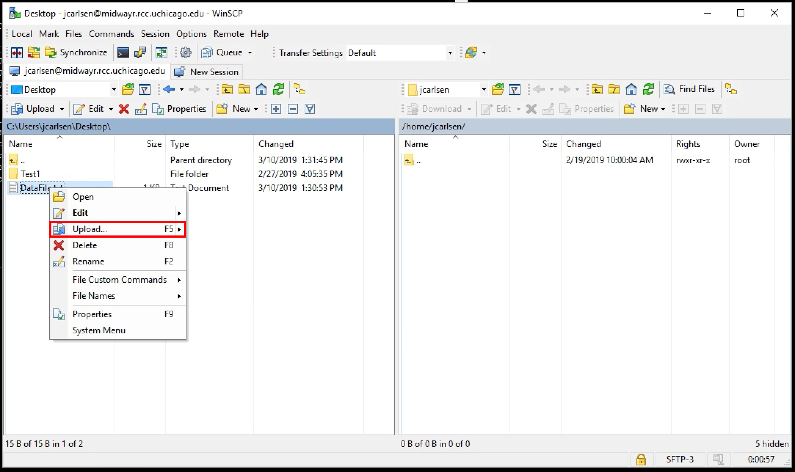

Transferring data from a Data Provider Server to the MidwayR3 HPC system involves a two-step process, using the Secure Data Enclave (SDE) Virtual Desktop as an intermediate staging area. The SDE desktop itself does not have computational capabilities and is intended only for temporary data storage until the data is fully migrated to MidwayR3. Since MidwayR3 does not have internet access available to general users, this intermediate step is necessary.

For moderately sized datasets (up to 1TB), users can follow the steps outlined below. If you need to transfer larger datasets, please contact us at midwayr-help@rcc.uchicago.edu to discuss alternative arrangements.

## Step 1. From Data Provider to SDE Virtual Desktop
Log in to SDE virtual desktop using your CNetID credential as described in [connecting chapter](connecting.md). Please note that only MidwayR3 users have access to the MidwayR3 HPC system. Having an RCC account on Midway ecosystem, such as Midway2 or Midway3, does not automatically grant you an account on MidwayR3.

### Method 1. Download Data from a Website
The SDE virtual desktop provides standard web browsers that can be used to access websites, log in with your credentials, and download data.

### Method 2. Download Data from a Server
In some cases, data provider servers may limit access through web browsers or support only a narrow range of data transfer protocols. 

Open the Command Prompt on the SDE virtual desktop. By default, it opens in your home directory. Be sure to navigate to the Downloads folder, which has a larger storage quota available.
```
cd Downloads
```
When connecting over HTTPS, you can use curl as a reliable alternative. Often, the data is provided in a compressed format such as .zip or .tar.gz. For example, GitHub repositories offer downloadable archives in these formats, making them a practical example for demonstration.
```
set url=https://github.com/example-owner/example-repo.zip
set output=data.zip
curl -L -o %output% %url% 
```
In this case, the repo is assumed to be public and no credentials are used. In cases when the repo is private, it is recommended to use an authorization token pre-configured on the remote host.
```
set GITHUB_TOKEN=yourtoken
curl --header "PRIVATE-TOKEN: %GITHUB_TOKEN%" -L -o data.zip https://github.com/example-owner/example-repo.zip
```
For cases when the data is hosted on the FTP server, make sure you have enabled TSL encryption and entered the username on the host server not your CNetID:
```
curl --ssl-reqd -u username ftp://example.host.edu/
```
You will be prompted to enter the password when establishing the connection. Avoid hardcoding the password directly in the curl command.

!!! warning
    Once your login session ends with SDE Virtual Desktop, all data that was downloaded will be purged.
!!! warning
    You can also run PowerShell on the SDE virtual desktop. However, the curl and wget commands are actually aliases for the slower Invoke-WebRequest cmdlet, not the real curl or wget utilities. To ensure proper functionality and performance, use curl.exe explicitly in your commands.
    

### Method 3. Download Data from UChicago Box 		
If regulated data was shared with you via UChicago Box or was originally collected through UChicago Box, you can access it using browser. Please consult with [UChicago Sensitive Data Usage Guide](https://dsc.uchicago.edu/university-of-chicago-sensitive-data-usage-guide/) for data types allowed in UChciago Box.

Once you logged in to the MidwayR3 desktop , you can open a browser and log in to a Box account at [https://uchicago.account.box.com](https://uchicago.account.box.com/login):<br><br>

<br><br>

Download files into the SDE desktop using the built-in Box Download function:<br><br>

<br><br>

By default it will copy the files into your Downloads folder, e.g. C:\Users\[CNetID]\Downloads:<br><br>

<br><br>


## Step 2. From SDE Virtual Desktop to MidwayR3
After the regulated data has been transferred from the Data Provider to the SDE virtual desktop, open the WinSCP application. While WinSCP can be used to connect to MidwayR3, connecting to any non-UChicago hosts is currently prohibited. Therefore, it cannot be used for the data transfer described in Step 1. <br><br>

<br><br>

Connect to midwayr.rcc.uchicago.edu with your CNet ID and password:<br><br>

<br><br>

Add the host key if this is your first time using WinSCP to move files:<br><br>

<br><br>

Move the folders or files you wish to MidwayR3 using the Upload function -- please do remember there is a 30GB quota on the home directories and a 500GB quota (default) on project, so we strongly recommend keeping your data in project:<br><br>

<br><br>
