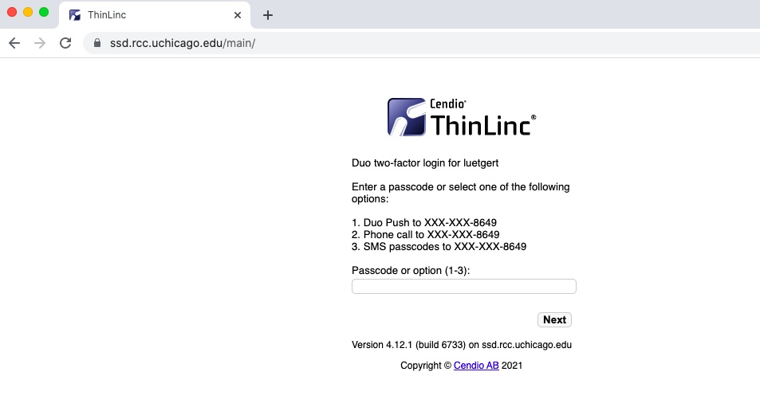
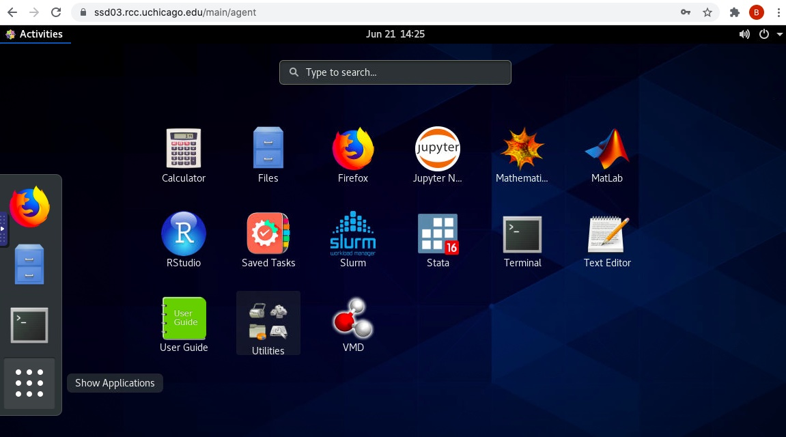

## Accessing MidwayBooth

To use MidwayBooth resources, you will need to have a Midway user account. If you do not have a Midway user account, please see the Getting Started section on how to apply. Note that you will either register for a PI or general user account. 

Please note that you must have enabled 
<a href="https://2fa.rcc.uchicago.edu" target="_blank">Two Factor Authentication</a>
for your CNetID before connecting to MidwayBooth. External collaborators will require a CNetID and should apply as a general user under their designated PI.

### Connecting to MidwayBooth

There are two alternative ways to connect to MidwayBooth. You may use a graphical user interface known as ThinLinc. This is accessed via your web browser and will give you a familar desktop-like environment for accessing your data and software. The second option uses an SSH connection in your terminal for command line interaction with MidwayBooth.

#### Connecting with ThinLinc

ThinLinc is a remote desktop server application. We recommend
using ThinLinc when you run software that requires a graphical user
interface, or "GUI" (e.g., Stata, MATLAB). For your convenience, the ThinLinc interface has been modified to give you a comfortable, familar experience comparable to your local machine, while you interact with the cluster. To use ThinLinc to connect to MidwayBooth, please take the following steps:

1. First connect to the UChicago VPN. You may use the Cisco AnyConnect client. Connect to `cvpn.uchicago.edu`. You will need to follow the two factor authentication prompts. 

2. Once connected to the VPN, open a browser (Chrome or Firefox) and enter
   `https://ssd.rcc.uchicago.edu` in the address bar.

3. Enter your CNetID and password on the ThinLinc login page:  

  

3. Follow the two factor authentication prompts:  

  

4. If the login process is successful, you will see a Linux desktop
environment. This is the ThinLinc GUI, indicating that you are now working on MidwayBooth:  

  

5. In order to access the software applications or a terminal window via ThinLinc, please select the Activities menu in the upper left corner or hover over and click on the icon of nine dots in a square along the left side as indicated below:  

  

6. The resulting view from opening the Applications window should look like the picture below. From here, you can click on any of the software applications and run as you would on a local machine. Please refer to the subsequent section on running applications in ThinLinc for more details:  

  

To disconnect and exit ThinLinc, close your selected application and click on the power button symbol in the upper right corner of the desktop as indicated below. Navigate to your name and select log out. Please note that closing the window tab will not end your interactive session on the login node. It is essential to disconnect when you have completed your work on MidwayBooth prior to closing the browser window.  
   

When successful, you should see the following confirmation of your disconnected session.  
   

#### Connecting with an SSH client

If you are more comfortable accessing MidwayBooth via SSH in your terminal, you can explore your file structure, submit jobs and move files without the ThinLinc graphical user interface. In this case, please open your terminal window on your local machine.

1. Enter `ssh cnetid@ssd.rcc.uchicago.edu` an hit return:  

2. Next, enter your CnetID and password. (There should be an
additional two-factor authentication at this step.)

At this point, if you successfully passed the password 
authentication step, you should be connected to one of the MidwayBooth
login nodes, either `ssd001`, `ssd002`or `ssd003`. 

3. To disconnect and close your MidwayBooth connection in the terminal, type `exit` and hit return.
