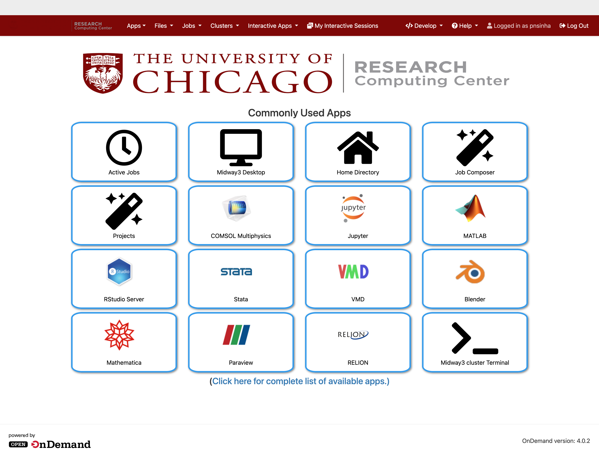

# Welcome to Open OnDemand at RCC UChicago

## Introduction

[Open OnDemand (OOD)](https://openondemand.org/) is a web-based portal that provides seamless, user-friendly access to High-Performance Computing (HPC) resources at the Research Computing Center (RCC), University of Chicago. With OOD, you can manage files, submit and monitor jobs, and launch interactive applications such as Jupyter, RStudio, and graphical desktop sessions—all from your web browser, without needing to use the command line.

Key features of Open OnDemand:

* **Web-based Access:** Access the cluster securely from anywhere using your browser.
* **File Management:** Upload, download, move, and edit files directly in your home or project directories.
* **Job Management:** Submit, monitor, and manage batch jobs using the Slurm scheduler with intuitive interfaces like Job Composer.
* **Interactive Apps:** Launch interactive sessions (e.g., Jupyter, RStudio, Visual Studio Code, Desktop) that run on compute nodes with easy resource selection.
* **Terminal Access:** Open a shell session to the cluster directly in your browser.
* **Project Organization:** Organize your work with project management tools.

## Why Use Open OnDemand?

Open OnDemand is designed to lower the barrier to HPC usage for both new and experienced users. It provides:

* a consistent, graphical interface for common HPC tasks,
* access to powerful interactive applications and remote desktops on the compute nodes,
* a platform that supports both research and teaching needs.
* the ability to work with files and jobs without learning Linux commands.

## Accessing Open OnDemand at the RCC

To access the RCC Open OnDemand service:

1.  Open your favorite web browser (Chrome, Firefox, Safari, or Edge are recommended).
2.  Navigate to `https://midway3-ondemand.rcc.uchicago.edu` using on-campus networks or [cVPN](https://uchicago.service-now.com/esc/escservices@uchicago.edu?id=kb_article&sys_id=9f963146330f2a9080866cdfcd5c7b68&spa=1).
3.  You will be prompted to log in with your CNetID and password.

Figure 1: Login screen

## Open OnDemand Dashboard

After logging in, you will see the Open OnDemand dashboard (Figure below). This is your main portal for accessing HPC resources.

Figure 2: OOD Dashboard showing commonly used apps

The entries in the top bar menu include:

* **Files**: Manage your files and directories in your home directory and other accessible storage locations on Midway. You can upload, download, copy, move, rename, and delete files and folders.

  
  
Figure 3: OOD File Manager with Upload dialog

* **Jobs**:
    * **Active Jobs**: View and manage your currently running and queued jobs on the Slurm scheduler.
    * **Job Composer**: Create and submit new batch jobs using predefined templates or by writing your own submission scripts.

      
      
Figure 4: OOD Job Composer user interface

      
      
Figure 5: OOD Job Composer showing job details and script contents

* **Clusters**: Access shell (terminal) access to the Midway3 cluster directly from your browser.
* **Interactive Apps**: Launch interactive graphical applications or server-based applications like Jupyter Notebooks, RStudio Server, and full Linux Desktop environments.
* **Projects**:

## Typical Workflow

1.  **Manage Files:** Use the Files app to upload data, organize directories, and edit scripts.
2.  **Submit Jobs:** Request resources to run the interactive applications, either by filling in the app form or by using the Job Composer app.
3.  **Launch Interactive Apps:** Start a Jupyter Notebook, RStudio Server, or a full Linux desktop session in a new tab on your web browser on the compute node. You can close the tab, and resume the session by clicking the button ``Launch [AppName]`` or ``Connect to [ServerName]`` in the Job card.
4.  **Monitor and Manage:** Track your jobs and sessions, and clean up resources when finished. Manage your research projects, potentially including data and job organization.

  
  
Figure 6: OOD Project Manager interface

## Using Interactive Apps

One of the most powerful features of Open OnDemand is the ability to launch interactive applications that run on the compute nodes of the Midway3 cluster.

**General Steps to Launch an Interactive App:**

1.  From the OOD dashboard, click on "Interactive Apps" in the top menu.

    
    
Figure 7: OOD Interactive Apps Dropdown Menu

2.  A dropdown list of available applications will appear (e.g., Midway3 Desktop, Jupyter Server, RStudio Server).
3.  Select the application you wish to use.
4.  You will be presented with a form (see figure below) to specify the resources for your session:
    * **Account**: Your Slurm account/allocation (if applicable).
    * **Partition**: The Slurm partition to run the job on.
    * **Number of hours**: How long you need the session.
    * **Number of CPU cores**: The number of processor cores.
    * **Memory**: The amount of memory (RAM) required.
    * Other application-specific options may also be available.
    
    
Figure 8: Job form to request resources for running the app

5.  Once you have filled out the form, click ``Launch``.
6.  Your job will be submitted to the Slurm scheduler. You will see its status in the "My Interactive Sessions" section of the dashboard.
7.  When the job starts and resources are allocated, which may take some time depending on the cluster load and your recent usage history, a Job card (see figure below) will appear with the ``Host`` field showing the compute node where your session is running on. Click on the button ``Connect`` or ``Launch`` to open your interactive session in a new browser tab.
    
    
Figure 9: Job card showing the running app with Host and Session ID with a link to the locaiton where the log files of the session are stored.

8.  When you are finished with your session, explicitly **close the application and then delete your interactive session** from the "My Interactive Sessions" page to free up resources.

<!---
## Important Information

**Key Points for Testers:**

* **Dedicated Testing Environment**:
    * A dedicated Slurm partition named `ondemand` has been created specifically for this testing phase.
    * This partition utilizes a selection of `cascadelake` nodes from Midway3: `midway3-0[001-002,008-019,022-038]`.
    * When launching interactive apps, please select the `ondemand` partition where appropriate and available in the application's form.
* **VNC Support**: VNC-dependent packages have been installed on these designated `ondemand` nodes to support interactive graphical applications.
* **Focus Areas for Testing**:
    * Overall usability and intuitiveness of the Open OnDemand interface.
    * Functionality of file management (upload, download, navigation).
    * Job submission and monitoring through the "Jobs" menu.
    * Launching and using available "Interactive Apps."
    * Stability and performance of interactive sessions.
    * Clarity of instructions and error messages.
-->

## Managing Your Sessions and Files

* **Interactive Sessions**: Always remember to explicitly **delete** your interactive sessions from the "My Interactive Sessions" page when you are finished. Simply closing the browser tab does NOT terminate the job on the cluster.
* **File Management**: Be mindful of your storage quotas. Data generated within Open OnDemand sessions is stored in your standard RCC home or project directories.

## Getting Help

For questions, issues, or assistance:

* Refer to the [RCC User Guide](https://rcc.uchicago.edu/support-and-services/user-guides/) (Link to the main RCC user guide).
* Contact RCC Support: `help@rcc.uchicago.edu`

We appreciate your help in making Open OnDemand a valuable resource for the RCC UChicago community!

