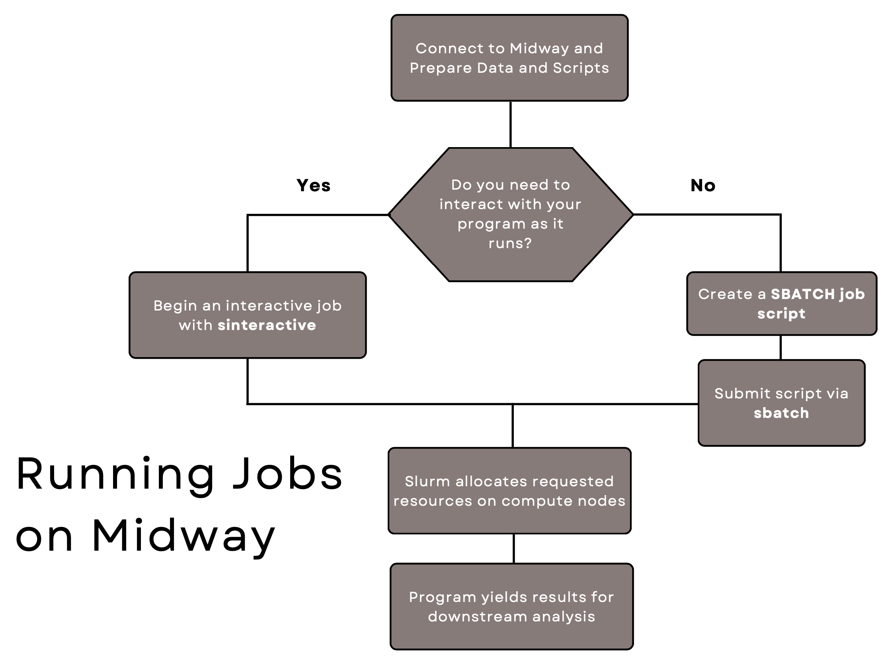

# Running jobs on RCC clusters

This page describes core concepts for running programs on RCC clusters. 

## Service units, allocations, and accounts 
All jobs running on RCC clusters compute nodes consume service units (SUs). In short, SUs measure the amount of computing resources (CPUs/GPUs/time) consumed on a compute cluster. 

!!! info "More information on SUs"
    In standard settings, 1 SU equals the usage of 1 processing unit for 1 hour, but the exact calculation will vary depending on the amount of memory requested, as well as additional factors like the use of GPUs and CPU architecture. By using SUs, we aim to provide “fair” access to computing resources.

SUs can be requested through an [allocation](https://rcc.uchicago.edu/accounts-allocations/request-allocation){:target='_blank'}. Allocations are ultimately associated with a PI's account. Thus, when we submit a job, we specify the account to which the SUs will be charged. If we submit a job on Midway2 without specifying an account, your default account (likely `pi-drpepper`) will be used. On Midway3 **you must** specify an account for a job to be successfully submitted. 
    
## Slurm workload manager

RCC's shared clusters (Midway2, Midway3, etc.) are compute clusters shared with the entire RCC user community. To keep track of the usage of this sharing computational resources:

1. Jobs must be scheduled in a way that is fair to all users. 

2. Consumption of resources needs to be recorded. 

3. Access to resources needs to be controlled. 

Consequently, the compute clusters use a **scheduler** to queue the requests for access to compute resources. These requests are called **jobs** and contain directions about the scripts/programs the user wants to run. In particular, we use the [Slurm](http://slurm.schedmd.com){:target='_blank'} workload manager to schedule jobs in batch and interactive formats.  

You can think of Slurm as the queue manager that facilitates access to the compute nodes. We submit a job to Slurm, which decides (based on current node utilization and the requested parameters) which compute nodes are permitted to use and available to send your job to. 

# Submitting Jobs
The flowchart below illustrates the main steps in that process. 

<p align="center">

</p> 

### Interactive (active) vs. batch (passive) jobs  
There are two main ways to run programs on RCC clusters: 

* Active via an "interactive session"; 

* Passive via a "batch job" 

It is important to note that in both ways you are essentially submitting a job to the SLURM scheduler. You have to wait for the requested resource (i.e. number of CPU cores, memory, and GPUs, if any) to be allocated to your session or job.

Interactive jobs allow you to actively interact with the program running on compute node(s) (e.g., executing cells in a Jupyter Notebook or analyzing output data using GUI applications) in real-time. This is great for exploratory work or troubleshooting. An interactive job will persist until you disconnect from the compute node or until you reach the maximum requested time. In an interactive session, you will load the necessary [software modules](../software/faq.md) and run your scripts in real-time.

Batch jobs are non-interactive: you prepare a text-based script where you specify the requested resource and the list of commands to be excuted on the compute nodes. You then submit the script to the SLURM scheduler via the ```sbatch``` command. As soon as the SLURM manager allocates the requested resource to the job, the commands in the script will get executed on the allocated nodes. A batch job terminates when either (1) all the commands in the script are complete, (2) the job's maximum time is reached, (3) an error occurs during the command execution, or you cancel the job via the ```scancel``` command.

* [Running jobs on RCC compute nodes through `sinteractive` (active) ](./sinteractive.md)
* [Submitting jobs to RCC compute nodes through `sbatch` (passive) ](./sbatch.md)

You can submit more than one interactive and batch jobs simultaneously. However, the number of simultaneous job and the accumulated requested resource are subject to the quality of service (QoS) of the partitions where you submit the jobs.

!!! note
     You can use the command ```scontrol show config``` to see the default values of the requested resource that SLURM will use for an interactive job or batch job.

## Job limits and QoS
To distribute computational resources fairly, the RCC limits the computing resources users request. These limits are enforced by the QoS (Quality of Service) assigned to each partition. A QoS is a set of parameters (e.g., MaxNodes, MaxCPUs, MaxWall, etc.) Read more about these regulations on our [partitions](../partitions.md#shared-partition-qos) page. 

Groups participating in the cluster partnership program (CPP) may customize resource limits for their partitions. 

Additional information on limits can be found by entering the command:  
```
rcchelp qos
``` 
Observe that QoS are often different depending on the partition.

You can request temporary exceptions to a particular limit by contacting our [Help Desk](https://rcc.uchicago.edu/support-and-services/consulting-and-technical-support){:target='_blank'}. Special allocations are evaluated on an individual basis and may or may not be granted.