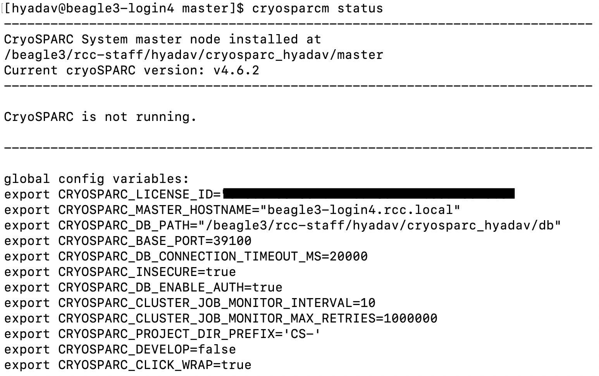
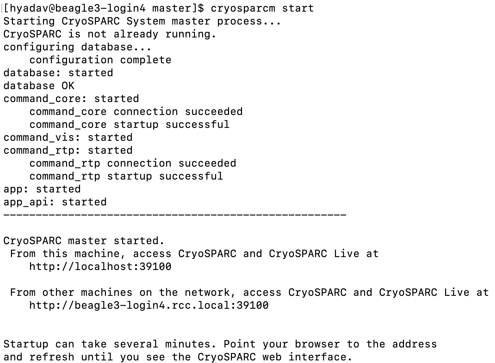
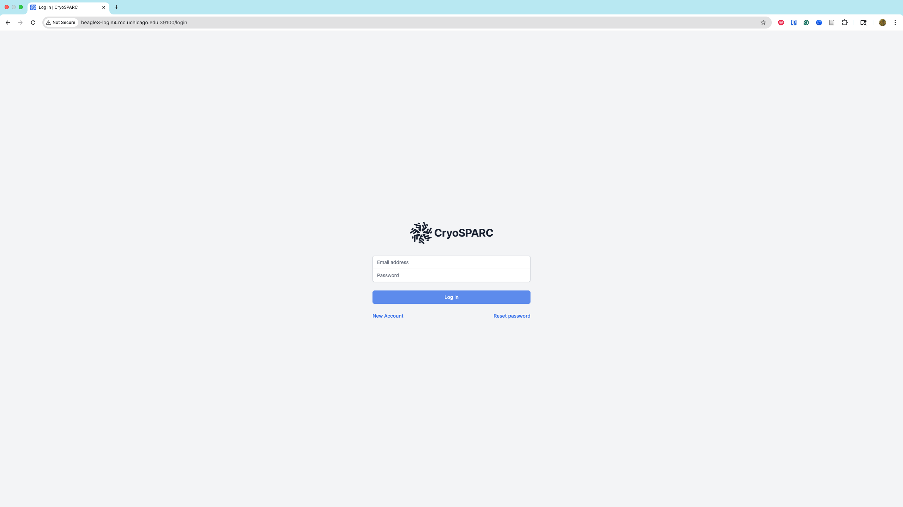
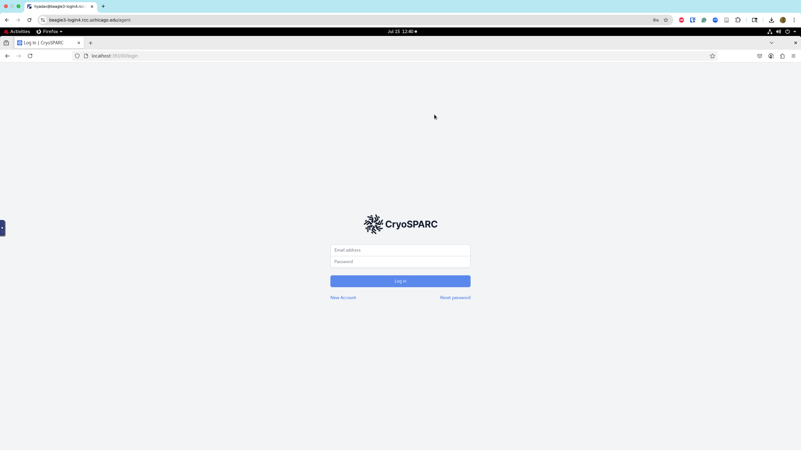

# CryoSPARC

CryoSPARC (Cryo-EM Single Particle Ab-Initio Reconstruction and Classification) is a state-of-the-art software platform for processing cryo-electron microscopy (cryo-EM) data. It functions as a dispatcher for cryo-EM workloads across a cluster of servers and workstations. RCC provides full support for CryoSPARC on the [Beagle3](../../beagle3-overview.md) cluster.

## Installation and Setup

To use CryoSPARC on Beagle3, you must first obtain a license from <a href='https://cryosparc.com/download' target='_blank'>CryoSPARC</a> and provide the license ID to RCC through either:

1. [This support form](https://rcc.uchicago.edu/support-and-services/consulting-and-technical-support){:target='_blank'}
2. Email: [help@rcc.uchicago.edu](mailto:help@rcc.uchicago.edu){:target='_blank'}

After receiving your license information, RCC will configure your account and provide:

1. Account credentials and setup details
2. A dedicated base port (typically in the range ``39100-39500``)
3. A designated host machine name (``beagle3-login3`` or ``beagle3-login4``)

## Getting Started

CryoSPARC's graphical user interface can be accessed through:

1. Your local machine's web browser (recommended for better performance)
2. [Thinlinc](../../thinlinc/main.md) 

### Initial Setup

**Log into your assigned host machine** (provided by RCC during account setup)
    ```
    ssh [your-cnetid]@beagle3-[login3 or login4].rcc.uchicago.edu
    ```

**Check CryoSPARC status** at any time using:
    ```
    cryosparcm status
    ```

<figure markdown="span" align="center">
  { width="600" }
  <figcaption><b>CryoSPARC Status</b></figcaption>
</figure>

**Start CryoSPARC** if it's not already running:
    ```
    cryosparcm start
    ```

<figure markdown="span", align="center">
  { width="600" }
  <figcaption><b>CryoSPARC Start</b></figcaption>
</figure>

### Accessing the GUI
Open a web browser **(preferably on your local machine for optimal performance)**  and navigate to your assigned host machine and port. The exact host machine name and port are also specified in the ``config.sh`` file located in the ``master`` folder of your installation directory.

!!! example "Example URL"
    ``http://beagle3-login4.rcc.local:39100/``

!!! warning "Important"
    **Always use the specific host machine name provided by RCC** to avoid service disruptions.

<div style="display: flex; justify-content: space-between; align-items: flex-start;">
  <figure style="width:48%; margin-right:2%; text-align: center;">
    
    <figcaption><b>Local Browser Access (Recommended)</b> - Better performance, faster response times.</figcaption>
  </figure>
  <figure style="width:48%; text-align: center;">
    
    <figcaption><b>Thinlinc Browser Access</b> - Useful when local network restrictions prevent direct access. Open Firefox within Thinlinc session</figcaption>
  </figure>
</div>
<!-- <figcaption style="text-align:center;"><b>CryoSPARC GUI Access Methods</b></figcaption> -->


## Troubleshooting

For comprehensive troubleshooting guidance, refer to the [official CryoSPARC troubleshooting documentation](https://guide.cryosparc.com/setup-configuration-and-management/troubleshooting). The following sections provide solutions to common issues.

### Socket Connection Error

**Error message:** ``unix:///tmp/cryosparc-supervisor–6410667835282660811.sock refused connection (already shut down?)``

**Solution:**

1. **Stop CryoSPARC:**
    ```bash
    cryosparcm stop
    ```

2. **Remove socket files:** Delete the specific `.sock` file mentioned in the error message:
    ```bash
    rm /tmp/cryosparc-supervisor–6410667835282660811.sock
    ```   

3. **Kill zombie processes:** Find and terminate any lingering processes:
    ```
    # Find process IDs
    ps -ax | grep "supervisor" | grep $USER 
    ps -ax | grep "cryosparc" | grep $USER 
    ps -ax | grep "mongod" | grep $USER 
    
    # Kill each identified process
    kill <PID>
    ```

4. **Restart CryoSPARC:**
    ```
    cryosparcm start
    ```
<!-- ### Database Connection Failure

1. Kill the mongo processes. You can find the process IDs using:

```ps -ax | grep “mongod”```
```kill <PID>```

2. Delete the ``.lock`` file at ``<cryosparc-install-dir>/db``

3. Start CryoSPARC again using:

```cryosparcm start``` -->

### Database Error

**Error message:**

```E STORAGE  [initandlisten] WiredTiger error (-31802) [1598020046:709343][4402:0x7f8f81a8fd40], file:sizeStorer.wt, WT_SESSION.open_cursor: unable to read root page from file:sizeStorer.wt: WT_ERROR: non-specific WiredTiger error```

```
Starting cryoSPARC System master process..
CryoSPARC is not already running.
database: ERROR (spawn error)
```
**Solution:**

1. **Create database backup:**
    ```
    cp -rav db db_backup
    ```

2. **Stop CryoSPARC:**
    ```
    cryosparcm stop
    ```

3. **Remove corrupted database:**
    ```
    rm -rf db
    ```

4. **Kill zombie processes:**
    ```
    # Find process IDs
    ps -ax | grep "supervisor" | grep $USER 
    ps -ax | grep "cryosparc" | grep $USER 
    ps -ax | grep "mongod" | grep $USER 
    # Kill each identified process
    kill <PID>
    ```
5. **Initialize new database:**
    ```
    cryosparcm start
    ```

6. **Stop CryoSPARC temporarily:**
    ```
    cryosparcm stop
    ```

7. **Restore database backup:**
    ```
    cp -rav db_backup db
    ```

8. **Repair database:** Navigate to the ``db`` directory and run:
    ```
    eval $(cryosparcm env)
    mongod --dbpath ./ --repair
    ```

9. **Start CryoSPARC**:
    ```
    cryosparcm start
    ```


