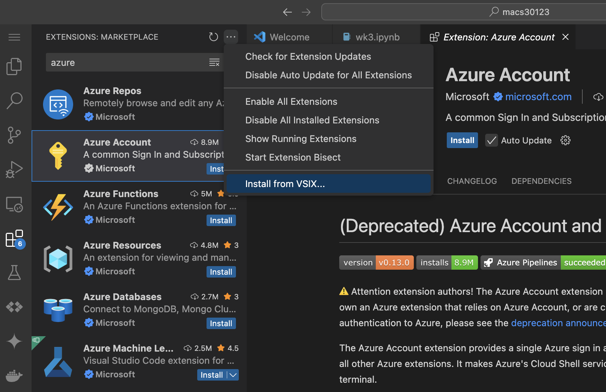

# Managing Extensions in `scode`

This guide explains how to manage Visual Studio Code extensions in server-based VS Code environments launched with `scode`. Extensions are critical for productivity, and there are multiple ways to install them depending on your workflow.

---

## Option 1: Install Extensions via CLI (Recommended)

The easiest way to install extensions for the VS Code Server is via the `scode` CLI **from a login node**:

```bash
scode ext install ms-python.python ms-toolsai.jupyter
```

You can use the `--env` option to specify the environment name (e.g., `default`).

To list environments or identify the current environment:

```bash
scode list
```

---

## Option 2: Porting Extensions from an Existing VS Code Installation

If you already have a working VS Code installation on your local machine, you can export and re-import them to your `scode` environment.

### Step 1: Export locally

On your **local machine**:

```bash
code --list-extensions > extensions.txt
```

An example `extensions.txt` file might look like this:
```
ms-python.python
ms-toolsai.jupyter
ms-vscode.cpptools
...
```

If you are using VS Code Insiders:
```bash
code-insiders --list-extensions > extensions.txt
```

If you need specific versions of extensions, you can use `--show-versions` to include extension version numbers:

```bash
code --list-extensions --show-versions > extensions.txt
```

### Step 2: Upload to the cluster

You can manually copy the contents of `extensions.txt` to the Midway cluster using clipboard and `nano`.

Alternatively, you can also use `scp` to copy the `extensions.txt` to your home directory:

```bash
scp extensions.txt <yourusername>@midway3.rcc.uchicago.edu:~
```

### Step 3: Installing extensions from a text file

Running this command **on a login node** will install all extensions listed in the file, essentially replicating your local VS Code environment.

```bash
scode ext install -f extensions.txt
```

!!! note

    It is possible to create an `extensions.txt` manually. Extensions IDs such as [`ms-python.python`](https://marketplace.visualstudio.com/items?itemName=ms-python.python) and [`ms-toolsai.jupyter`](https://marketplace.visualstudio.com/items?itemName=ms-toolsai.jupyter) can be found on the [VS Code Extension Marketplace](https://marketplace.visualstudio.com/vscode).

---

## Option 3: Install Extensions Manually via the VS Code Web UI

This method is not recommended due to its complexity, but it can work as an expedient way for installing one or two extensions on the fly.

### Step 1: Download the Extension (`.vsix`) To Your Local Machine

**From a running `scode` session** (if you already have the VS Code Server Web UI started with `scode`)

1. Open your VS Code Web UI in the browser
2. Go to the **Extensions Panel**
3. Search for the desired extension
4. Click the **"Install"** button. VS Code will complain that an internet error prevented a successful installation
5. Click **"Try Downloading Manually..."** to download the `.VSIXPackage` file to your local machine

{: class="responsive-img rounded"}

**From your local machine** (If you haven't had the Web UI set up with `scode`)

1. Open the VS Code application **on your local machine**
2. [Optional] Connect to the Midway cluster via SSH
3. Go to the **Extensions Panel** (left sidebar)
4. Search for the desired extension (e.g., `Python`, `Jupyter`)
5. Right-click the extension and select **"Download VSIX"** to save the `.VSIXPackage` file locally

{: class="responsive-img rounded"}

### Step 2: Installing the `.vsix` file

!!! warning inline end

    VS Code saves extension files as `.VSIXPackage` by default. You **MUST** rename the extension to `.vsix` in lowercase to make it installable from the Web UI.

1. Open your VS Code Web UI in the browser
2. **Rename the `.VSIXPackage` file extension to `.vsix`**
3. Go to the **Extensions Panel** (left sidebar)
4. Click the **three-dot menu (⋮)** in the top-right corner of the panel
5. Choose **"Install from VSIX..."**
6. Click **"Show Local"** on the top right of the file selector
7. Select the `.vsix` file from your local machine and wait for the installation to complete

{: class="responsive-img rounded"}

---

## Additional Commands

### List installed extensions

```bash
scode ext list
```

### Update all extensions

You can run the `update` command periodically to keep your extensions up to date:

```bash
scode ext update
```

### Uninstall extensions

```bash
scode ext uninstall ms-python.python ms-toolsai.jupyter
```

---

## Troubleshooting

- **When installing new extensions while the VS Code server is running**, you may need to run **Reload Window** from the VS Code command palette, or restart the `scode` job for the changes to take effect.
- Always confirm you are working in the correct environment by running `scode list`, use `--env` option if you wish to interact with a specific environment.
- If you are **serving a non-latest version of VS Code** by specifying `--version` with `serve-web`, you may need to specify a matching `--cli-version` when running `scode ext install` to ensure extension compatibility. **It is recommended to always use the latest version of VS Code Server** unless needed.
- For more help, run `scode ext --help`.
