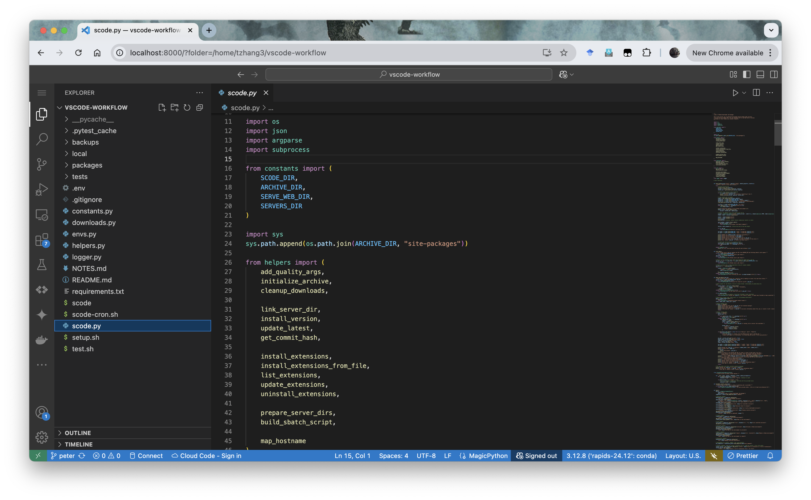

# Getting Started with `scode`

To support the growing demand for interactive development on Midway, RCC provides `scode`: a command-line utility that allows users to securely launch, manage, and access Visual Studio Code (VS Code) web sessions running entirely on compute nodes from their browser.

`scode` addresses the challenge of setting up a VS Code session on compute nodes, which lack direct Internet access due to security considerations. It enables users to interactively develop, debug, and optimize HPC applications without the overhead of repeatedly submitting batch jobs, streamlining workflows such as model training, data analysis, and code prototyping.

{: class="responsive-img"}

This guide provides a minimal and reliable workflow to help you get started with a VS Code Web session, monitor its status, and connect securely from your local machine.

To install extensions, see the [Extension Installation Guide](./extensions.md). For more information on using `scode`, please refer to the [SCode API Documentation](./api.md).

---

## 🚀 Quick Start

| **Step**   | **Description**                                                                                   | **Command / Action**                                                  | **Run On**       |
| ---------- | ------------------------------------------------------------------------------------------------- | --------------------------------------------------------------------- | ---------------- |
| **Step 1** | [Load `scode` & install necessary extensions](#step-1-setting-up-scode)                                               | `module load scode` <br/> `scode ext install ms-python.python ms-toolsai.jupyter`            | 🔐 Login Node    |
| **Step 2** | [Launch VS Code Server](#step-2-launch-a-vscode-server)                                            | `scode serve-web -- --account <pi-account> --time 01:00:00 --mem 16G` | 🔐 Login Node    |
| **Step 3** | [Check job status & get connection info](#step-3-check-job-status)                                | `scode jobs status <job_id>`                                          | 🔐 Login Node    |
| **Step 4** | [Create SSH tunnel from your local machine](#step-4-create-an-ssh-tunnel-from-your-local-machine) | Follow the SSH command printed in **Step 3**                          | 💻 Local Machine |
| **Step 5** | [Access VS Code in your browser](#step-5-access-vscode-in-your-browser)                          | Open the web link provided in **Step 3**                              | 💻 Local Machine |
| **Step 6** | [End the session](#step-6-ending-the-session)                                                     | `scancel <job_id>`                                                    | 🔐 Login Node    |

---

## Step 1: Setting Up `scode`

### Step 1.1: Loading the `scode` Module

In order to run the `scode` command, first load the `scode` module **from a login node**:

```bash
module load scode
```

This will activate the `scode` command in your environment. You can add this command to your `~/.bashrc` or `~/.bash_profile` for automatically loading `scode` in future sessions.

```bash
echo "module load scode" >> ~/.bashrc
source ~/.bashrc # Reload the shell configuration
```

??? question "What is a `.bashrc` file?"

    The `.bashrc` file is your personal script that automatically configures your environment every time you open a new terminal.
  
    | File Name          | Scope         | When It’s Executed                            | Common Use Cases                                                                      |
    | ------------------ | ------------- | --------------------------------------------- | ------------------------------------------------------------------------------------- |
    | `/etc/bash.bashrc` | System-wide   | For every user’s interactive, non-login shell | Set default aliases and functions for all users on the system.                        |
    | `~/.bashrc`        | User-specific | For a user’s interactive, non-login shells    | The main file for personal aliases, functions, and prompt customizations.             |
    | `~/.bash_profile`  | User-specific | For a user’s login shell                      | Set environment variables and run commands that only need to happen once per session. |
    | `~/.profile`       | User-specific | Fallback for `~/.bash_profile`                | A more generic version that can be used by other shells, not just Bash.               |

    For your day-to-day terminal customizations like aliases and prompt settings, `~/.bashrc` is the correct file to edit.

### Step 1.2: `~/.bashrc` Environment Setup

To use `scode` and other tools effectively in VS Code Server, It is recommended to have your environment correctly initialized by modifying your `~/.bashrc`.

```bash
# ~/.bashrc
export MY_VAR="HelloWorld"
module load python/anaconda-2023.09
```

This will ensure that necessary environment variables and system modules such as `python`, `cuda` and `java` are available in both the terminal and within VS Code extensions.

!!! tip

    VS Code Server automatically sources `~/.bashrc` at startup. A properly set up `~/.bashrc` can help:
    
    - VS Code `Python` extension to detect and use the correct `Python` versions.
    
    - The integrated terminal to use your configured modules and environment variables.

### Step 1.3: Install Necessary VS Code Extensions

To take full advantage of language features in VS Code (e.g., autocompletion, linting, Jupyter notebook support), you can install the relevant extensions using `scode` before [starting the server](#step-2-launch-a-vscode-server).

For instance, for Python developments, run the following command **on the login node**:

```bash
scode ext install ms-python.python ms-toolsai.jupyter
```

For more details, see the [Extension Installation Guide](./extensions.md).

---

## Step 2: Launch a VS Code Server

Once the module is loaded, you can submit a job to start a VS Code Web server. Run the following command **from a login node**:

```bash
scode serve-web -- --account <pi-account> --time 01:00:00 --partition caslake --mem 16G
```

- `<pi-account>`: Replace this with the name of your Principal Investigator (PI) or course account. This account will be used to provision compute nodes in the specified partition.
- To view the accounts you are associated with and check available allocations, use `groups`, `accounts list` and `accounts balance`. Refer to the documentation for [`groups`](../../../partitions.md#what-partitions-i-can-use) and [`accounts`](../../../101/allocations.md#how-do-i-check-how-many-service-units-i-have-remaining-on-my-allocation) commandline utilities for more details.
- Additional slurm options can be added to the `scode serve-web` command **after the standalone `--` separator**. Refer to [Slurm User Guide](../../../slurm/sbatch.md) and [Sbatch Documentation](https://slurm.schedmd.com/sbatch.html) for more details on job submission options.

This command will:

- Submit a SLURM job to run the VS Code Web server
- Prepare the environment and server installation automatically
- Return the job ID and logging paths

Example output:

```bash
Submitting SBATCH to serve VS Code environment.

Submitted batch job 30317404

sbatch: Verify job submission ...
sbatch: Using a shared partition ...
sbatch: Partition: caslake
sbatch: QOS-Flag: caslake
sbatch: Account: <pi-account>
sbatch: Verification: ***PASSED***

SBATCH job /home/<yourusername>/.scode/sbatches/scode-web_20250409_101953.sbatch submitted successfully.
Output will be directed to /home/<yourusername>/.scode/logs/scode-web_30317404.out.
Errors will be directed to /home/<yourusername>/.scode/logs/scode-web_30317404.err.
VS Code server is starting with Slurm Job ID 30317404.
Use `scode jobs status 30317404` to check the status of the server.
Use `scancel 30317404` to cancel the server job.
```

---

## Step 3: Check Job Status

To view active VS Code Server jobs, run the following command **on the login node**:

```bash
scode jobs list
```

To check the status of a specific job and retrieve connection details, use the job ID returned from the previous step:

```bash
scode jobs status 30317404
```

If the job is running, you will receive detailed connection instructions.

Example output:

```bash
VS Code job 30317404 is running on 1 nodes: midway3-0024
Primary node: 10.50.250.24
Environment: /home/<yourusername>/.scode/envs/stable/default


To connect to the VS Code Web GUI you need to create an SSH tunnel from your local machine to the primary node above. This can be done with the following command to be run on your local machine (e.g., PowerShell in Windows):

    ssh -L 8000:10.50.250.24:61028 <yourusername>@midway3.rcc.uchicago.edu

Once the tunnel is created, you may access the VS Code Web GUI by entering the following address in your browser:

    http://localhost:8000/?tkn=f1c72d89-4a5e-43d2-ae1b-9b8237dce021

Server outputs are being written to /home/<yourusername>/.scode/logs/scode-web_30317404.out.
Server errors are being written to /home/<yourusername>/.scode/logs/scode-web_30317404.err.
You may use `squeue -j 30317404` to see more information about this job, or cancel it with `scancel 30317404`.
```

In this output:

- `8000` is a port **on your local machine**. All traffic to this port will be forwarded to the remote VS Code Web server with SSH tunnel. You can change this port if it is already in use.
- `61028` is the port **on the compute node** where the VS Code Web server is running, which is randomly assigned by SCode.
- When running `scode jobs status 30317404`, scode will automatically fill in `<yourusername>` and the ssh endpoint for you (in this example, `midway3.rcc.uchicago.edu`), so that you can directly copy and run the tunnelling command in your local terminal.

---

## Step 4: Create an SSH Tunnel from Your Local Machine

On your **local machine**, open another terminal, and run the SSH command shown in the job status output. For example:

```bash
ssh -L 8000:10.50.250.24:61028 <yourusername>@midway3.rcc.uchicago.edu
```

This command creates a secure channel between port `8000` on your local computer and the remote VS Code Web server running inside the cluster.

- Be sure to use the IP address and port number from your actual job output.
- Use a different local port if `8000` is already in use.

**Keep this terminal open** while you are working inside the VS Code Web session. Closing the tunnel will interrupt your connection.

---

## Step 5: Access VS Code In Your Browser

Once the SSH tunnel is active, open up a browser session **on your local machine** and follow the link from `scode jobs status`:

```plaintext
http://localhost:8000/?tkn=f1c72d89-4a5e-43d2-ae1b-9b8237dce021
```

Modify port `8000` if you used a different local port in **Step 4**.

You will be redirected to a fully functional VS Code Web interface running on the cluster, within your compute environment.

---

## Step 6: Ending the Session

When you are done:

- Close the browser tab (to avoid dangling temp files in your home directory)
- Cancel the SLURM job:

```bash
scancel 30317404
```

If not manually cancelled, the job will terminate when the time limit expires.

Now you can close the SSH tunnel terminal as well.

---

## Troubleshooting

1. Why won’t my SSH tunnel connect?

    - **Are you running the SSH command on your local machine?**
        The `ssh -L …` command must be executed from **your local computer**, not inside the cluster.
    - **Connection refused errors:**
        If you see `channel x: open failed: connect failed: Connection refused`, try cancel and relaunch the VS Code Server job, then re-run the SSH tunnel command with the updated host/port from `scode jobs status <job_id>`.

2. What if port 8000 is already in use?

    - **Local port conflict:**
        By default, we forward `localhost:8000` → remote VS Code port. If `8000` is busy, choose another free port:
        `ssh -L 9000:10.50.250.24:61028 <yourusername>@midway3.rcc.uchicago.edu`

    - **Remember to update the browser URL** to `http://localhost:9000/?tkn=…`.

3. I see `ECONNREFUSED 127.0.0.1:9999` in the logs—should I worry?

    - **No.** `scode` uses a dummy `HTTP_PROXY` to bypass the VS Code Server update check. It prevents the server from hanging while looking for updates. You can safely ignore those warnings.

4. Server details aren’t shown when I run `scode jobs status` yet.

    - **Startup delay:** The SBATCH job may still be booting.
    - **What to do:** Wait 10–30 seconds and rerun `scode jobs status <job_id>`, then inspect the Slurm output log at `~/.scode/logs/scode-web_<job_id>.out` for progress messages.

5. Where can I get more help?

    - **Built‑in help:** `scode --help` and `scode <command> --help`.
    - Refer to [SCode API Documentation](./api.md) for more details.
