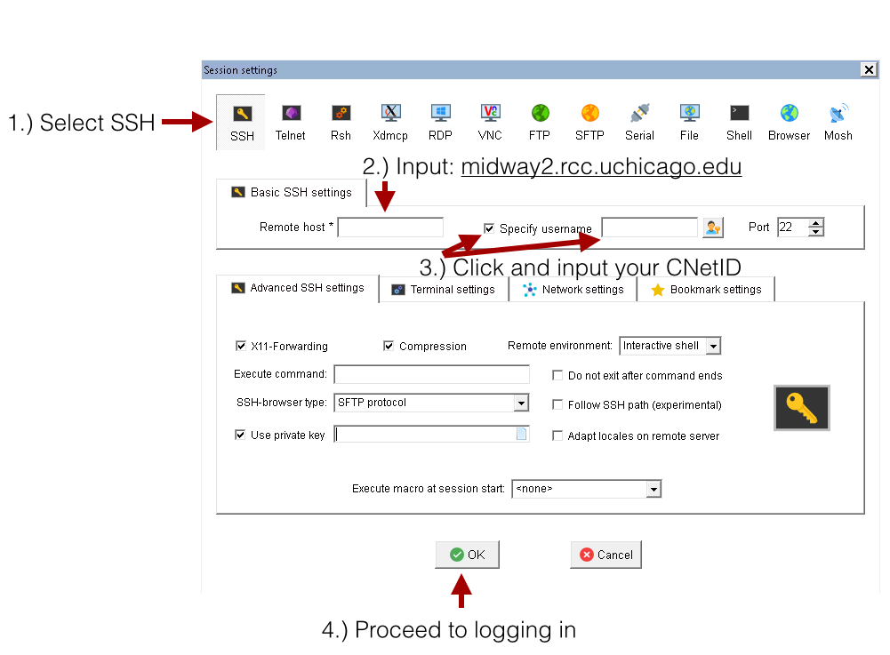
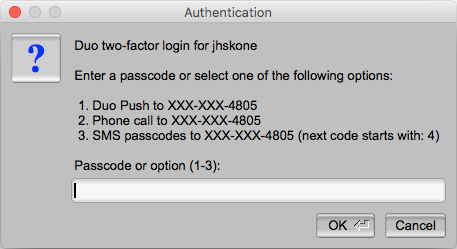

# Advanced SSH options

* File sharing: 
	
	Sharing files within the RCC clusters ecosystem using the command line and understanding file/folder permissions and data privacy. 
	
* Helpful SSH arguments (X11 forwarding, etc.) 
* Advanced access control via ACL


## X11 forwarding
X11 forwarding is a mechanism that allows you to forward a remote application's display (from clusters) to your local machine (client). To enable X11 forwarding when connecting to an RCC cluster system through SSH, the `-Y` flag should be included, for example: 
    ```
    ssh -Y <CNetID>@midway3.rcc.uchicago.edu
    ```

??? note "Note for macOS users"
    The program XQuartz is required to enable trusted X11 forwarding on a Mac.
    
## File permissions and ownership

Linux divides file permissions into read (`r`), write (`w`), and execute (`x`) permission categories. 

| Letter | Name | More detail |
|-|-|-|
| `r` | read    | Read permission allows to view or copy file contents to an external directory. |
| `w` | write   | In addition to all of the `r`, write permission allows modification of file content. |
| `x` | execute | Execute permission allows us to run/execute files in the directory. | 

These three permissions are defined for each of the three owner types typically referred to as User (`u`), Group (`g`), and Others (`o`). 

| Letter | Name | More detail |
|-|-|-|
| `u` | user    | User is a single user who owns the file. |
| `g` | group   | Group is a collection of users who can access the file. |
| `o` | other | Consists of all the users on the system. | 

!!! note
	Only the file owner or a directory can change its permissions or the group name to one of their groups.

For example, here, we want to check the file access permissions of `myfile.dat`, by running the `ls -l` command: 

```
$ ls -l myfile.dat
```
we get: 
```
-rw-r--r-- 1 jdoe pi-drpepper 8444 Feb 20 12:49 myfile.dat
```
Here is how we interpret the symbols on the left. First, we break it into four parts: 
`-` `rw-` `r--` `r--` 

`- (part 0)` `rw- (part 1)` `r-- (part 2)` `r-- (part 3)` 

* `rw- (part 1)` means the file owner (`jdoe`) can read and modify (write) this file. 
* `r-- (part 2)` means the group members of `pi-drpepper` can only read this file but not modify it. 
* `r-- (part 3)` means others who are not even part of the group also can read this file. 

<p align="center">

</p> 

### Data sharing
To set up user permissions to a folder recursively, you can run the following command in the absolute mode, providing three [permission bits](https://www.guru99.com/file-permissions.html#absolute_mode_in_linux) for the User (7), Group (5), and Others (5): 
```
$ chmod -R 755 myfolder
```
where 7=4+2+1 (`rwx` for User), 5=4+0+1 (`r-x` for Group), and 5=4+0+1 (`r-x` for Others). This is equivalent to the following command in a symbolic mode: 
```
$ chmod -R u=rwx,go=rx myfolder
```
where, unlike the absolute mode, users can override (`=`), add (`+`), or remove (`-`) all or selected permissions for the owner (`u`), group (`g`), or others (`o`).

Summary of the default file system permission of the most commonly used directories on RCC clusters:

| Directory              | Permissions    | Permissions bits                         |
|------------------------|----------------|------------------------------------------|
| `$HOME`                | drwx------     | `700` – Accessible only to the owner     |
| `$SCRATCH`             | drwx------     | `700` – Accessible only to the owner     |
| `/project/drpepper` | drwxrws---     | `770` – Read/write for the project group |
| `/project2/drpepper` | drwxrws---     | `770` – Read/write for the project group |
| `/dali/drpepper` | drwxrws---     | `770` – Read/write for the project group |

When new files or directories are created, the `umask` influences the default permissions of those files and directories.  The default value of `umask` is set to `0002`, which means that newly created files will have permissions of 664 (`-rw-r--r--`) and newly created directories will have permissions of 775 (`drwxrwxr-x`). 

In your home directory, the group owner will be set to your personal user group, the same as your CNetID, so you will still be the only user to access your files and directories. 

Note that in the project directories, the group owner will be the same as the directory owner, and the default permission of 2775 (`drwxrwsr-x`, read `d` `rwx` `rws` `r-x`). Here, the extra bit `2` will replace group permission `x` with `s` to enable users to execute the folder/files with the same permissions as the group owner. 

Here is an example of what this means in practice:

```default
$ ls -ld $HOME 
drwx------ 108 jdoe jdoe 32768 2013-01-15 10:51 /home/jdoe
```

```
$ ls -ld /project/drpepper
drwxrws---  3 drpepper      pi-drpepper 32768 2013-01-15 10:48 /project/drpepper
```

Let's check this with an example. Using `touch`, we create two identical files, one in our home and the other under `drpepper`'s project directory. 
```
$ touch $HOME/newfile /project/drpepper/newfile
```

Now, let's compare the permissions of these two files: 
```
$ ls -l /project/rcc/newfile $HOME/newfile
-rw-rw-r-- 1 jdoe jdoe			0 2023-01-01 00:00 /home/jdoe/newfile
-rw-rw-r-- 1 jdoe pi-drpepper 0 2023-01-01 00:00 /project/drpepper/newfile
```

Both files are readable and writable by the group owner due to the default `umask`, but the group owners differ due to the sticky bit being set on `/project/drpepper`. This applies only to newly created files and directories. The ownership and permission may change if files or directories are moved from elsewhere.

To change the permission of a directory, you can use `chgrp -R`: 

```
$ chgrp -R pi-drpepper myfolder
```
This will overwrite the group permissions of all of the files and folders under `myfolder` directory. 
```
$ ls -l myfolder
-rwxrwxr-x 1 jdoe pi-drpepper 0 Feb 20 12:49 myfile.dat
-rwxrwxr-x 1 jdoe pi-drpepper 0 Feb 20 12:51 myfile2.dat
```

!!! warning Locked out
      If you need our help to overwrite the file permission of a directory, please reach out to us. Remember, the account owner can ask for this only for files under `/home` and `/scratch`; only PIs can request this for files under their group-shared directories. 

   
## Advanced access control via ACL
!!! note
      ACL is only available on Midway2.

Access control list [(ACL)](https://www.redhat.com/sysadmin/linux-access-control-lists) provides an additional, more flexible permission mechanism for file systems. It is designed to assist with UNIX file permissions. ACL allows you to give permissions to any disk resource for any user or group. For more information, please visit the ACL manual [here](https://wiki.archlinux.org/index.php/Access_Control_Lists). 


The default Linux file permission management covered in the previous section only supports the permissions at the owner/group/others level. ACL provides more precise control over any data (files or directories) customizable for individual users or groups. Before applying ACL to your data, please read and understand the following caveats. 

* By default, no ACL is set for user data. ACL provides a highly flexible permission control but also increases user access and management complexity. PIs normally want to share an entire project folder with all group members; for this, the Linux-based permissions are enough. We suggest that users implement ACL controls only when necessary. One example is to protect confidential data in the project space by allowing only certain users to access confidential directories or files.


* After ACL is set, Linux-based and ACL permissions will work together as a dual-guard system. The final effective access to data is granted only if permitted by both mechanisms. For example, if a folder is group-accessible to a user by Linux-based permission but restricted by ACL, the user cannot access this folder.


* Be sure you have enough knowledge setting up access via Linux-based permissions and ACL, i.e., you understand what “users”, “groups,” and each attribute in `rwx` mean and how to use them. Otherwise, please [contact our helpdesk](https://rcc.uchicago.edu/support-and-services/consulting-and-technical-support) for assistance managing your data access. We are here and happy to help you set up the permissions to keep your data safe and accessible as required.


### Sharing folders with a user within a group
Suppose there is a folder tree as below, and you want to allow the folder `my_folder` to be accessible by the user `drwho` only, and `drwho` is already a member of your group `drpepper`:

```default
/project2/drpepper
   |- my_folder
   |- other_stuff
```

Before using ACL, you need to confirm that this folder is open to all members in the group `drpepper`:

```default
$ cd /project2/drpepper
$ chgrp -R pi-drpepper my_folder
```
And, 
```
$ cd /project2
$ chmod -R 770 drpepper
$ cd drpepper
```

By this steo, the folder `drpepper ` becomes readable and writable by all members of group `pi-drpepper`. Then, you can use the `setfacl` command to control the individual user's access precisely. First, you need to remove the default group access by ACL:

```default
$ setfacl -m g::--- my_folder
```

Although the command `ls -l` will still display group `rwx` access for the `my_folder` folder in the Linux-based permissions, users cannot access it anymore due to the permission set by ACL. Then, you can grant the user `drwho` access to the folder:

```default
$ setfacl -m u:drwho:rwx my_folder
```

At this step, the user `drwho` has both read and write permissions to the folder `my_folder`. You can set up permissions for each user the way you want.

To view the list of configured accesses on the folder `my_folder`, run:

```default
$ getfacl my_folder
# file: my_folder
# owner: drwho
# group: pi-drpepper
user::rwx
user:drwho:rwx
group::---
mask::rwx
other::---
```

To revoke the permissions of the user `drwho` to the folder:

```default
$ setfacl -x u:drwho my_folder
```

To clean up (remove) all ACL controls to the folder:

```default
$ setfacl -b my_folder
```

### Sharing folders with a user outside a group

Suppose you would like to share your folder `/project2/drpepper/my_own_folder/shared_data` with another RCC user with CNetID `drj`, who is not in your group `pi-drpepper`. As the folder owner, you can execute the following two commands.
```
setfacl -Rm d:u:drj:rw-,u:drj:rw- /project2/drpepper/my_own_folder/shared_data
setfacl -m u:drj:--x /project2/drpepper/my_own_folder
```
The first command changes the ACL permission of the folder (and recursively its sub-folders and files) to allow the user `drj` to read and write. The second command adds execute permission to `drj` so that `drj` can access the parent folder `/project2/drpepper/my_own_folder` without read or write permissions. 

## MobaXterm

Once the MobaXterm client is installed on your local machine, open the MobaXterm client and click on the Sessions icon at the upper left-hand corner of the client. Then, perform the following numbered steps, illustrated in the figure below, to establish a connection to RCC clusters. 

1. Click the SSH tab to expand the SSH login options.
2. In the Remote host field input, please check [this table](ssh.md) for the cluster's host address. 
3. Select the Specify username button and input your CNetID
4.  Proceed to log in by clicking the OK button. 


<p align="center">

</p> 

Provide your CNetID password when prompted for a password. A Duo two-factor authentication window will then pop up, requesting you select from the 2FA options to authenticate.

<p align="center">

</p> 

## SSH Key Pairing
Members of the `pi-lgrandi` group (for the <a href='https://github.com/XENONnT' target='_blank'>XENON experiment</a>) can use SSH key pairing to connect to RCC servers without using two-factor authentication (2FA). Briefly, the RCC adds a public key to its server that corresponds to a private key on your computer. This allows the server to recognize your computer, so you don't have to use 2FA to verify your identity. (For a more detailed explanation, read this <a href='https://www.digitalocean.com/community/tutorials/how-to-configure-ssh-key-based-authentication-on-a-linux-server' target='_blank'>guide to SSH key pairing</a>.)

To set up SSH key pairing:

**1. Create your public key** Run the following command on your computer to generate a public key. (Replace `<cnetid>` with your CNet ID.) Be sure you are **not** connected to an RCC server when you run the command; you want your public key associated with your **local system**, so RCC servers can use it to recognize your computer.

```
ssh-keygen -f ~/.ssh/<cnetid> -t rsa -b 4096
```

When you run this command in your shell (Mac terminal, Windows PowerShell, etc.), you will get a message specifying where your key has been saved. For example:

```
Your identification has been saved in /Users/<cnetid>/.ssh/<cnetid>
Your public key has been saved in /Users/<cnetid>/.ssh/<cnetid>.pub
```
Note that the `.` in `.ssh` indicates a hidden folder, so you will need to show hidden items to see your `<cnetid>.pub` file. You can do this from your shell (run `ls -la`) or your file explorer (press `command` + `shift` + `.` on Mac or select View > Hidden items on Windows).

**2. Share your public key** Now that you have generated your public key, share it with the RCC so we can add it to our server. Send <a href=mailto:'help@rcc.uchicago.edu'>help@rcc.uchicago.edu</a> an email with the following information:

* Your CNet ID
* Your public key (attach your `<cnet>.pub` file to the email or copy/paste the contents of the file into the body of the email)
* Which RCC cluster you would like to connect to with SSH key pairing: Midway2, Midway3, or DaLI

An RCC staff member will add your public key to the appropriate RCC server so you can use SSH key pairing to connect to the cluster you specified.