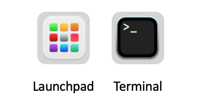
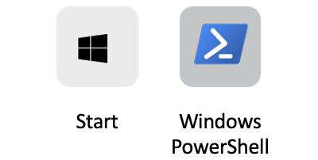
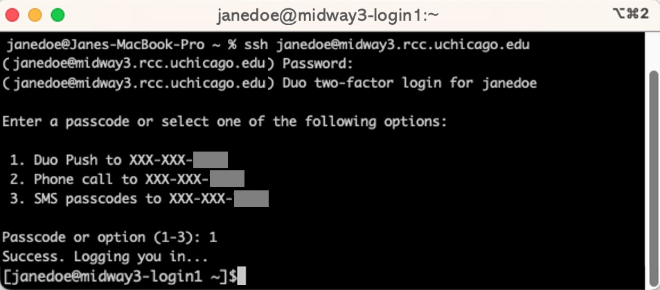
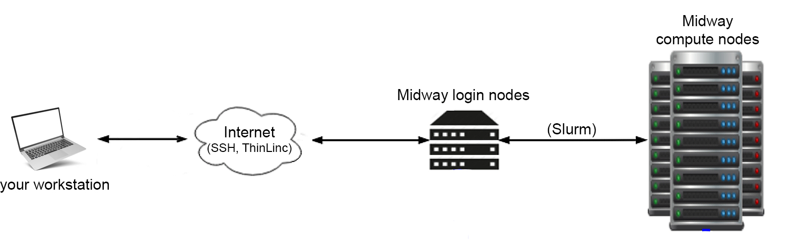

# SSH (Secure shell)

In this article, step-by-step, we review the process "SSH"ing to RCC's clusters so you know what is happening. 

## Connecting to RCC clusters through SSH
There are countless 3rd party SSH clients for Windows, Mac, Linux (all flavors), Android, Chromebook, etc. 
SSH client means an application installed on your computer/phone that can connect your computer (client) to RCC clusters (host) through SSH protocol. 
Microsft Windows, Apple Mac Computers, and all flavors of Linux come with a preloaded SSH (native) SSH client. 
Here, we focus on connecting to RCC clusters using these native clients if you are a pro user, consider using other 3rd party, more robust SSH clients (e.g. iTerm2, Termius, etc.) 

***Apple Macintosh (Mac)***
 
Macintosh machines, through the "terminal," can access the system's native SSH client app. Click on "launchpad," then search and open the "terminal" app. 

<p align="center">

</p> 

***Microsft Windows (10 and 11)***
Through the "Windows PowerShell," Windows machines can access the system's native SSH client app. Click on the "start" menu, then search and open the "Windows PowerShell" app. 

<p align="center">

</p> 

!!! note Windows users running a version older than Windows 10’s April 2018 release will have to download a 3rd party SSH client to connect via SSH. We recommend a free version of [Termius](https://termius.com/download/){:target='_blank'} SSH client. 

Now that we have "terminal" or "PowerShell" open. We can SSH to RCC clusters. 

The general format of the command to connect to an SSH host is this: 

`ssh <username>@<hostname>` 

Here, instead of `username`, type in your `CNetID`, and `hostname`, depending on the cluster you need to connect, use one of the following SSH host addresses: 

### SSH host addresses 

#### Shared clusters
| Host name | SSH host address |
|---|---|
| Midway2 | `midway2.rcc.uchicago.edu` |
| Midway3 | `midway3.rcc.uchicago.edu` |
| Midway3-AMD | `midway3-amd.rcc.uchicago.edu` |  
| DaLI | `dali-login.rcc.uchicago.edu` | 

####  Restricted clusters
|Cluster's host name|SSH host address|
|---|---|
| Beagle3 | `beagle3.rcc.uchicago.edu` |
| SSD | `ssd.rcc.uchicago.edu` |

Note: For the family of `MidwayR` clusters, please check the MidwayR user guide. 

For example, to SSH to Midway3, we type in 
`ssh jdoe@midway3.rcc.uchicago.edu` and then press `enter` on Windows or `return` on Apple keyboards. 

If this is your first time signing into a particular RCC cluster using your computer, the SSH client will ask, `Are you sure you want to continue connecting?`. Type `yes` and press the 'enter' button on your keyboard. 

Then, we get a prompt to enter our CNetID `password`. Note, as you type in your password, no character or other symbol will appear, but it is alright; type in your password and press `enter` on Windows or `return` on Apple keyboards. 

Then, the Duo's multi-factor authentication (MFA) prompt asks a few questions. 

<p align="center">

</p> 

After Duo's multi-factor authentication (MFA), you land on one of the many RCC's **login nodes**. `CNetID@clusterName-loginNodeNumber` 

!!! note
	See [Advanced SSH options](./advance.md) to read more about different arguments you can add to your SSH commands. 
	
### Login nodes	
Login nodes are the "foyer" of the RCC's clusters. They are connected to the Internet and enable you to transfer data to and from the system. They are not designed to carry out heavy workloads, and you should **NOT run your computation on the login nodes**. To connect to **compute nodes** to do computationally intensive work, there is one more step you need to go through. 
x
<p align="center">

</p> 

!!! warning
    The login nodes are **NOT** for computationally intensive work.  

!!! note
	Login nodes have a small storage space for users to store a very small volume of data required for back-end processes such as authentication and other system-related processes upon logging in. Login nodes are not a storage space to save and install our packages. 
	
!!! note
    In compliance with the University of Chicago security guidelines, 2FA is required with limited exceptions. If you believe you have a justifiable need for SSH key-based authentication (only PIs), please [contact our helpdesk](https://rcc.uchicago.edu/support-and-services/consulting-and-technical-support){:target='_blank'} and describe your situation. Once your request is received, the RCC security team will review it, and we will follow up with you as soon as possible. 

!!! note
    There are 2 or more login nodes on each cluster to share the workload from all the login users. You can land on one of the login nodes depending on their workload conditions at the time. You may choose to log in to a specific login node, e.g. `midway2-login2.rcc.uchicago.edu`, but it is typically discouraged.

### Compute nodes
Compute nodes are designed to perform computationally intensive work. There is no Internet access on these nodes. To perform calculations or run simulations on the compute nodes, you need to submit job scripts to the queue via the ```sbatch``` command or via the ```sinteractive``` command to log into the allocated nodes  directly. More information is given in [this page](../slurm/main.md). 


### Storage nodes 
Storage nodes generally store all files and folders under users' home, scratch, and PI's group project directories. To learn more about how storage nodes are interconnected to compute nodes and across RCC clusters (Midway2, 3, Beagle, DaLi, etc.), check [this page](../storage/main.md). 


### Data transfer
#### SCP - secure copy protocol
To copy files and folders from your personal computer (client) to RCC clusters (host) through SSH protocol, we use the following command, known as `SCP` (secure copy protocol.)

Open `Terminal` (Macintosh) or `Windows Powershell` (Windows)

`scp <sourceFile> <CNetID>@<hostAddress>:<targetPath>`

Example 1-a: Copying a single file from Jane's personal computer (client) to Dr. Pepper's `project` directory:
 
`scp test.txt jdoe@midway3.rcc.uchicago.edu:/project/drpepper/users/jdoe/`

Example 1-b: Copying a single file from Jane's personal computer (client) to her `home` directory:
 
`scp test.txt jdoe@midway3.rcc.uchicago.edu:/home/jdoe/Documents/`

Example 2-a: Copying a directory (collection of files) from Jane's personal computer (client) to Dr. John's `project` directory:

`scp -r tests jdoe@midway3.rcc.uchicago.edu:/project/drpepper/users/jdoe/`

On MacOS, you need to add ```-O``` if there is no folder with the same name on the target server:

`scp -O -r tests jdoe@midway3.rcc.uchicago.edu:/project/drpepper/users/jdoe/`

Example 2-b: Copying a directory (collection of files) from Jane's personal computer (client) to her `home` directory:

`scp -r tests jdoe@midway3.rcc.uchicago.edu:/home/jdoe/Documents/`

After pressing `enter` on your keyboard, the rest is the same as logging into RCC clusters through SSH. 

#### SFTP - SSH file transfer protocol
SFTP is another SSH-based file transfer protocol that provides access, transfer, and management over any reliable data stream. RCC clusters support SFTP, and we strongly recommend this protocol for transferring data to/from RCC clusters. [Termius](https://termius.com/download/){:target='_blank'} SSH client, also supports SFTP. 

<p align="center">

</p>
<p align="center">
<a href="ttps://termius.com/download/">Termius</a>
</p> 
 
#### Rsync 

Rsync is a fast and versatile file transfer tool that keeps track of progress and the differences between the source and destination. There are many optimizations under the hood that make rsync tranfer files faster compared to ```scp```. More information on the ```rsync``` command can be found at [the rsync man page](https://www.unix.com/man-page/redhat/1/rsync/).

Example 1: Copy/synchronize folder ```tests``` from Midway3 to your current directory

`rsync -avzhe ssh jdoe@midway3.rcc.uchicago.edu:/home/jdoe/Documents/tests .`

Example 2: Copy/synchronize folder ```tests``` from your current directory to Midway3

`rsync -avzhe ssh tests jdoe@midway3.rcc.uchicago.edu:/home/jdoe/Documents/`

