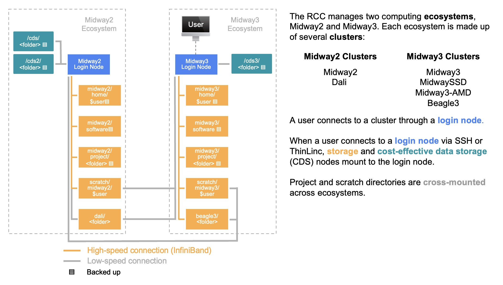

# System Layout

Midway2,  Midway3, and Beagle3 have a high-performance GPFS shared file system that houses private **home** directories, shared **project**, **project2**, and **beagle3** spaces, and high-throughput **scratch** space. The shared and scratch directories of Midway2, Midway3, and Beagle3 are 'cross-mounted', meaning that they are accessible from system-specific login and compute nodes. However, `/home`, `/software`, and `/snapshots` are specific to each cluster and their respective login nodes.

<p align='center'>

</p>

!!! note "Folder Access"
      You and you alone have access to your personal home directory (`/home/<CNetID>`), whereas everyone who is a member of your research group (`pi-<PI_CNetID>`) has access to your project folder (`/project/<PI CNetID>`).

## Quotas

The amount of data that can be stored in home directories, project directories, and shared scratch directories is controlled by quota. RCC enforces hard and soft limits on quotas. A soft quota can be exceeded for a short period of time, called a grace period.  The hard quota cannot be exceeded under any circumstances. 


=== "Midway2, DaLI"
      |  Name   | Location | Soft Quota | Hard Quota | Suitable For |
      |---------|----------|------------|------------|--------------|
      | Home    | `/home/$USER`            | 30 GB <br /> (or 300K files) | 35 GB <br /> (or 1M files) | Personal data  |
      | Project | `/project2/<folder>`  | varies                     | varies                   | Shared data, environments  |
      | Scratch | `/scratch/midway2/$USER` | 100 GB <br /> (or 10M files) | 5 TB <br /> (or 20M files) | Temporary files            |
      | DaLI | `/dali/<folder>` | varies | varies | Shared data, environments            |
      
      
===+ "Midway3, Beagle3"
      | Name    | Location | Soft Quota | Hard Quota | Suitable For |
      |---------|----------|------------|------------|--------------|
      | Home    | `/home/$USER`            | 30 GB <br /> (or 300K files) | 35 GB <br /> (or 1M files) | Personal data  |
      | Project | `/project/<folder>`      | varies                  | varies                   | Shared data, environments  |
      | Scratch | `/scratch/midway3/$USER` | 100 GB                       | 5 TB                       | Temporary files            |
      | Beagle 3 project | `/project/<folder>`      | varies                     | varies                   | Shared data, environments |
      | Beagle 3 scratch | `/scratch/beagle3/$USER` | 400 GB  <br /> (or 5.1M files) | 1 TB <br /> (5.6M files) | Temporary files           |

=== "CDS"
      | Name    | Location | Soft Quota | Hard Quota | Suitable For |
      |---------|----------|------------|------------|--------------|
      | CDS | `/cds/<folder>` | varies | varies | Long-term, less frequently accessed shared data.  |      
      | CDS2 | `/cds2/<folder>` | varies | varies | Long-term, less frequently accessed shared data.            |
      | CDS3 | `/cds3/<folder>` | varies | varies | Long-term, less frequently accessed shared data. |

To check your current quotas, use the following commands:
```
quota -u $USER
```
```
rcchelp quota
```

<details>
<summary>Explain a typical output</summary>
```
---------------------------------------------------------------------------
fileset          type                   used      quota      limit    grace
---------------- ---------------- ---------- ---------- ---------- --------
home             blocks (user)         8.77G     30.00G     35.00G     none
                 files  (user)        157865     300000    1000000     none
scratch          blocks (user)       101.07G    100.00G      5.00T  30 days
                 files  (user)        193028   10000000   20000000     none
---------------- ---------------- ---------- ---------- ---------- --------
>>> Capacity Filesystem: project2 (GPFS)
---------------- ---------------- ---------- ---------- ---------- --------
pi-drpepper         blocks (group)       59.10T     60.00T     60.00T     none
                 files  (group)     45825436  384500000  385500000     none
---------------- ---------------- ---------- ---------- ---------- --------
---------------------------------------------------------------------------
```
<table>
    <thead>
        <tr>
            <th>Field</th>
            <th>Meaning</th>
        </tr>
    </thead>
    <tbody>
        <tr>
        <!-- Row 1 -->
            <td>fileset</td>
            <td>File set or file system where this quota is valid</td>
        </tr>
        <tr>
      <!-- Row 2 -->
            <td>type</td>
            <td>Type of quota. *Blocks* are the amount of consumed disk space. *Files* are the number of files in a directory. Blocks (or files) quotas can be set at the user or group level.</td>
        </tr>
        <tr>
        <!-- Row 3 -->
            <td>used</td>
            <td>The amount of disk space consumed or the number of files in the specified location.</td>
        </tr>
        <tr>
        <!-- Row 4 -->
            <td>quota</td>
            <td>The *soft quota* (disk space or file count) associated with the specified location. It is possible for usage to exceed the soft quota for the grace period or up to the hard limit.</td>
        </tr>
        <tr>
        <!-- Row 5 -->
            <td>limit</td>
            <td>The *hard quota* (disk space or file count) associated with the specified location. When your usage exceeds this limit, you will NOT be able to write to that filesystem.</td>
        </tr>
        <tr>
        <!-- Row 6 -->
            <td>grace</td>
            <td>The amount of time remaining that the soft quota can be exceeded. *None* means that the quota is not exceeded. After a soft quota has been exceeded for longer than the grace period, it will no longer be possible to create new files.</td>
        </tr>                
    </tbody>
</table>

</details>

!!! warning "Over quota?"
      If you exceed your quota, it can lead to errors since numerous applications may become unable to function properly. See our [data management FAQ](./faq.md) for multiple strategies for getting back under quota.


## High-Performance Storage

### Home Space 

Every user has Midway2 and Midway3 home directories `/home/$USER`. **Midway2 home dierctory** is accessible from Midway2 and DaLI login nodes, while **Midway3 home directory** from Midway3, Beagle3, and SSD login nodes. Home directories are generally used for storing files that do not need to be shared with others and are only accessible by their owner (mode `0700`).

### Research Space

Every user who belongs to one or many `pi-<PI_CNetID>` groups has access to the shared **Midway2 project directories** located at `/project2/<PI_CNetID>`. Additionally some groups may have purchased a dedicated **Midway3 project space** `/project/<PI_CNetID>` or be authorized to access **Beagle3 project space** at `/beagle3/<PI_CNetID>`. All these directories are accessible by all members of the PI's group and are generally used for storing, processing, and analyzing research data that needs to be shared by members of the group. The default group ownership is set to the PI group with read-write permissions for files and directories created in the research space using a sticky bit (mode `2770`). Users may request access to multiple research spaces by submitting a [request](https://rcc.uchicago.edu/accounts-allocations/join-different-pi-account){:target="_blank"} to be approved by the PI.

### Scratch Space

#### Global Scratch

High-performance shared scratch spaces on Midway2 `/scratch/midway2/$USER`, Midway3 `/scratch/midway3/$USER`, and Beagle3 `/scratch/beagle3/$USER` are intended to be used for reading or writing data required by jobs running on the cluster. If a user is over quota, they can use scratch space as a temporary location to hold files (and/or compress them for archival purposes). The default permissions for scratch space allow access only by its owner (mode `0700`). 

!!! warning
      Scratch space is neither snapshotted nor backed up; it should always be viewed as temporary, short-term storage only. It is the user's responsibility to ensure any important data in scratch space is moved to persistent storage. 


#### Local Scratch 
There is also a scratch space that resides on the local solid-state drives of each node and can only be used for jobs that do not require distributed parallel I/O. The capacity of the local solid-state drives varies across the systems and may depend on the usage of the node if your job resource request does not give you exclusive access to a node. <br></br>
It is recommended that users use the local scratch space if they have high throughput I/O of many small files ( size < 4 MB) for jobs that are not distributed across multiple nodes. To write files to local scratch, use environment variables `$TMPDIR` or `$SLURM_TMPDIR`, which are set to `/tmp/jobs/${SLURM_JOB_ID}` and add a line at the very end of your Slurm script to copy or move the output to the research space upon job completion. Otherwise, all temporary files will be purged once the job is completed or crashed.
To check the size of the local scratch, submit an interactive job and execute the following command on the compute node:
```
df -h $TMPDIR
```

## Cost-Effective Data Storage  
In addition to a high-performance GPFS file system, RCC also offers **Cost-effective Data Storage (CDS)** through the [Cluster Partnership Program](https://rcc.uchicago.edu/support-and-services/cluster-partnership-program){:target='_blank'} for long-term data storage. CDS is only available from login nodes and is meant to be used as a storage for less frequently accessed data. Before performing any computation on the data stored on CDS, it first needs to be copied to a high-performance file system.

CDS includes multiple tiers (`/cds`, `/cds2`, `/cds3`) with the new data to be stored in `/cds3` cost-effective storage. Additionally, data can be moved from old tiers to the most recent tier using Globus. A user would need to provide the path on each endpoint, such as /cds or /cds2 on Midway2 and /cds3 on Midway3.  

## Data Recovery and Backups

### Snapshots

Automated snapshots for the GPFS directories (`home`, `project2`, `project`, `beagle3`, and `dali`) and CDS directories (`cds`, `cds2`, and `cds3`) are available from the login nodes for a limited time. Note that snapshot top-level directories, `.zfs` and `.snap`, are hidden and cannot be listed with `ls -al`. Instead, simply navigate to the directory as provided by the snapshot path:

=== "Midway2, DaLI"
      | Directory           | Snapshot kept        | Snapshot Path                                    |      
      |---------------------|----------------------|--------------------------------------------------|
      | `/home/$USER`       | 7 daily and 2 weekly | `/snapshots/home/<SNAPSHOT>/home/<CNetID>`       |
      | `/project2/<folder>`| 7 daily and 2 weekly | `/snapshots/project2/<SNAPSHOT>/project2/<folder>`|
      | `/dali/<folder>`    | 7 daily and 2 weekly | `/gpfs3/cap/.snapshots/<SNAPSHOT>`|

      Note: In order to access DaLI snapshots, first you need to log into one of the DaLI compute nodes. 

===+ "Midway3, Beagle3"
      | Directory           | Snapshot kept        | Snapshot Path                                    |      
      |---------------------|----------------------|--------------------------------------------------|
      | `/home/$USER`       | 7 daily and 4 weekly | `/snapshots/<SNAPSHOT>/home/<CNetID>`            |
      | `/project/<folder>` | 7 daily and 4 weekly | `/snapshots/<SNAPSHOT>/project/<folder>`         |
      | `/beagle3/<folder>` | 7 daily and 4 weekly | `/beagle3/.snapshots/<SNAPSHOT>/beagle3/<folder>`|

=== "CDS"
      | Directory           | Snapshot kept        | Snapshot Path                                    |      
      |---------------------|----------------------|--------------------------------------------------|
      | `/cds/<workspace>/<folder>`     | 4 hourly, 7 daily, 4 weekly | `/cds/<workspace>/.zfs/snapshot/<SNAPSHOT>/<folder>`            |
      | `/cds2/<workspace>/<folder>`     | 4 hourly, 7 daily, 4 weekly | `/cds2/<workspace>/.zfs/snapshot/<SNAPSHOT>/<folder>`            |
      | `/cds3/<workspace>/<folder>`     | 12 hourly, 7 daily, 4 weekly, 2 monthly | `/cds3/<workspace>/.snap/<SNAPSHOT>/<folder>`            |
      
The `<SNAPSHOT>` refers to the backup time, e.g., `daily-YYYY-MM-DD.0Xh30` or `weekly-YYYY-MM-DD.0Xh30`. To restore a file from a snapshot, simply copy it to where you want it with either `cp` or `rsync` or any other preferred method. 

## Purchasing More Storage  
Additional storage is available through:  
<a href='https://rcc.uchicago.edu/support-and-services/cluster-partnership-program' target='_blank'>The Cluster Partnership Program</a>  
<a href='https://rcc.uchicago.edu/research-allocation-request' target='_blank'>Research I Allocation</a>  
<a href='https://rcc.uchicago.edu/research-allocation-request-II' target='_blank'>Research II Allocation</a>  
<a href='https://rcc.uchicago.edu/special-allocation-request' target='_blank'>Special Allocation</a>


