# ThinLinc - Remote desktop 
## Connecting with ThinLinc
ThinLinc is a remote desktop server used to connect to RCC clusters and obtain a remote graphical user interface (GUI). We recommend using ThinLinc to use software that requires a GUI. Remember, ThinLinc is much less stable than SSH. 

There are two methods to access ThinLinc on RCC clusters:
1. Through a web browser
2. Using the ThinLinc app. 

### Accessing ThinLinc through a web browser   
Point your web browser to the following web address: 

=== "DaLI"
    ```
    https://dali-login1.rcc.uchicago.edu/main/
    https://dali-login2.rcc.uchicago.edu/main/
    ```

=== "Midway2"
    ```
    https://midway2.rcc.uchicago.edu.
    ```
    You will land on this page:
    <p align="center">
    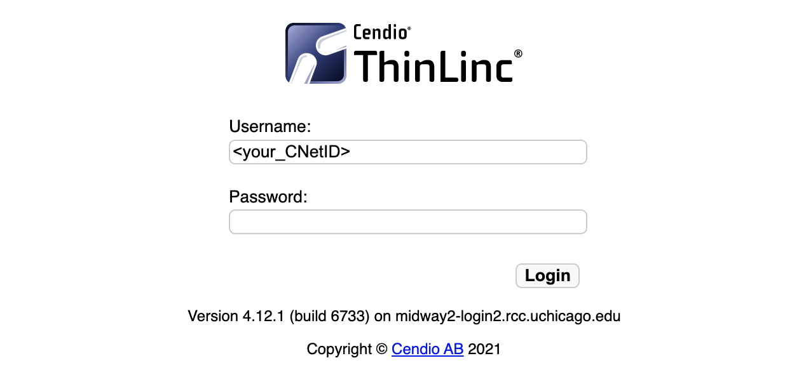
    </p> 

===+ "Midway3"
    ```
    https://midway3.rcc.uchicago.edu.
    ```
    You will land on this page:
    <p align="center">
    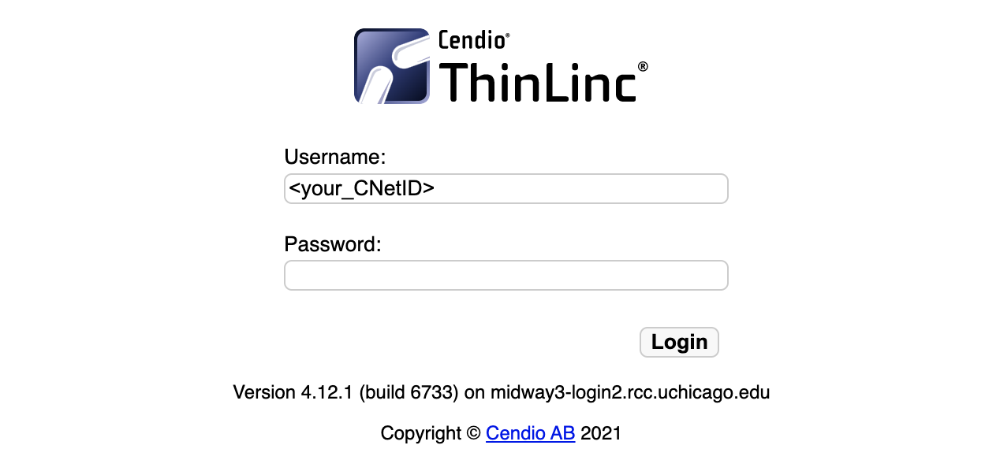
    </p> 

=== "Midway3-AMD"
    ```
    https://midway3-amd.rcc.uchicago.edu/
    ```

=== "MidwaySSD"
    ```
    https://ssd.rcc.uchicago.edu/
    ```
=== "Beagle3"
    ```
    https://beagle3.rcc.uchicago.edu/
    ```

Proceed to log in with your CNetID and password.

Duo two-factor authentication will request you select from the 2FA options to authenticate.


### Accessing ThinLinc through the client (app)
Download and install the appropriate ThinLinc client [here](https://www.cendio.com/thinlinc/download). 

Open the ThinLinc client (app) and use the following information to set up your connection to Midway:

=== "DaLI"
    ```
    Server: dali-login1.rcc.uchicago.edu/main/
    Server: dali-login2.rcc.uchicago.edu/main/
    Username: CNetID
    Password: CNetID password
    ```

=== "Midway2"
    ```
    Server: midway2.rcc.uchicago.edu
    Username: CNetID
    Password: CNetID password
    ```
    Your client should look similar to this:
    <p align="center">
    
    </p> 

===+ "Midway3"
    ```
    Server: midway3.rcc.uchicago.edu
    Username: CNetID
    Password: CNetID password
    ```
    Your client should look similar to this:
    <p align="center">
    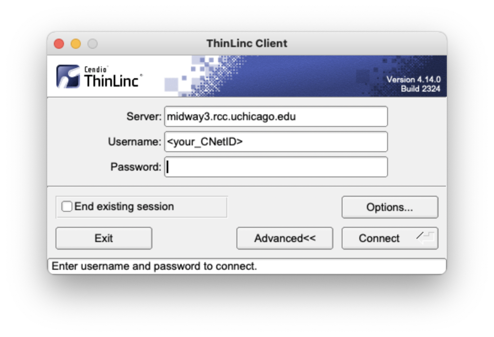
    </p> 

=== "Midway3-AMD"
    ```
    Server: midway3-amd.rcc.uchicago.edu/
    Username: CNetID
    Password: CNetID password
    ```

=== "MidwaySSD"
    ```
    Server: ssd.rcc.uchicago.edu
    Username: CNetID
    Password: CNetID password
    ```
    Your client should look similar to this:
    <p align="center">
    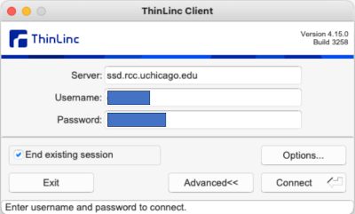
    </p> 
    <p align="center">
    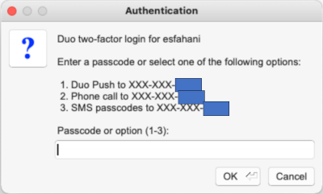
    </p> 
    <p align="center">
    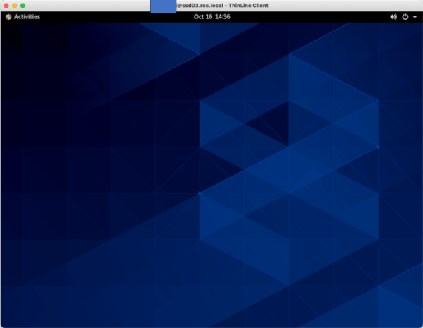
    </p> 

=== "Beagle3"
    ```
    Server: beagle3.rcc.uchicago.edu/main/
    Username: CNetID
    Password: CNetID password
    ```

The default setting for the ThinLinc client opens a fullscreen window that fills “all monitors.” If you prefer to work with ThinLinc from its own window, click `Options` from the initial login interface and then Screen to adjust your settings. The following is an example of a setup that places the ThinLinc client in its own window: 

<p align="center">
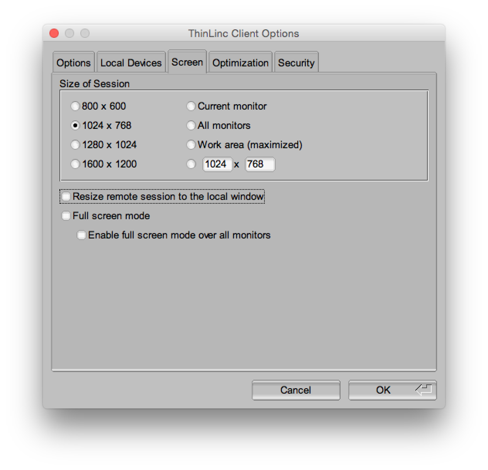
</p> 

Optional: You are also able to export local resources via ThinLinc. To do so, click Options from the initial login interface and then Local Devices. To adjust your settings for exporting the local file system, click Details next to Drives.

<p align="center">
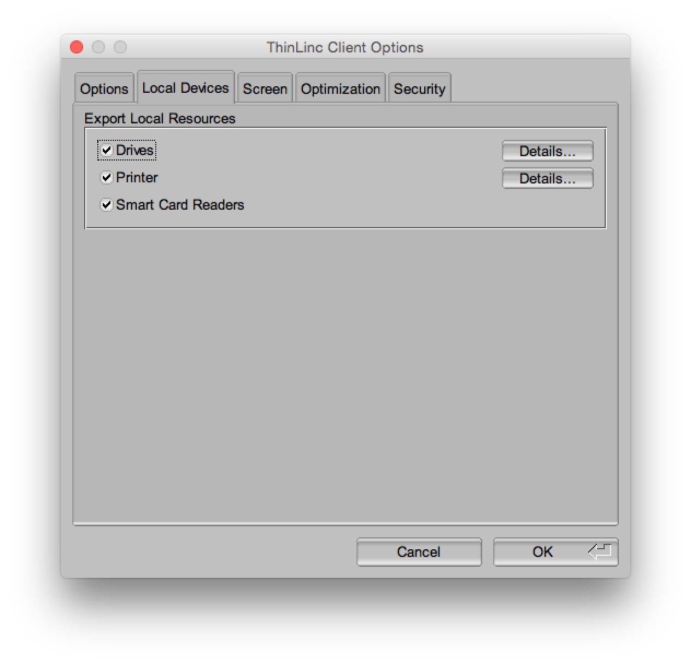
</p>

After clicking the `Connect` button, Duo two-factor authentication will request you select from the 2FA options to authenticate.

<p align="center">
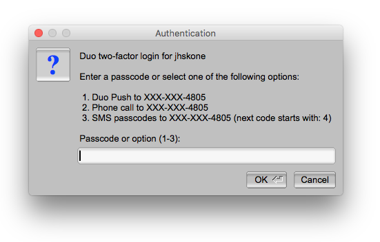
</p>

## The ThinLinc interface

=== "Midway2, DaLI"
	You will be presented with an `IceWM desktop` upon successfully logging in. Select the `Applications` tab in the top left corner to access the terminal (for interactive sessions), file browser, and other utilities. 
	<p align="center">
	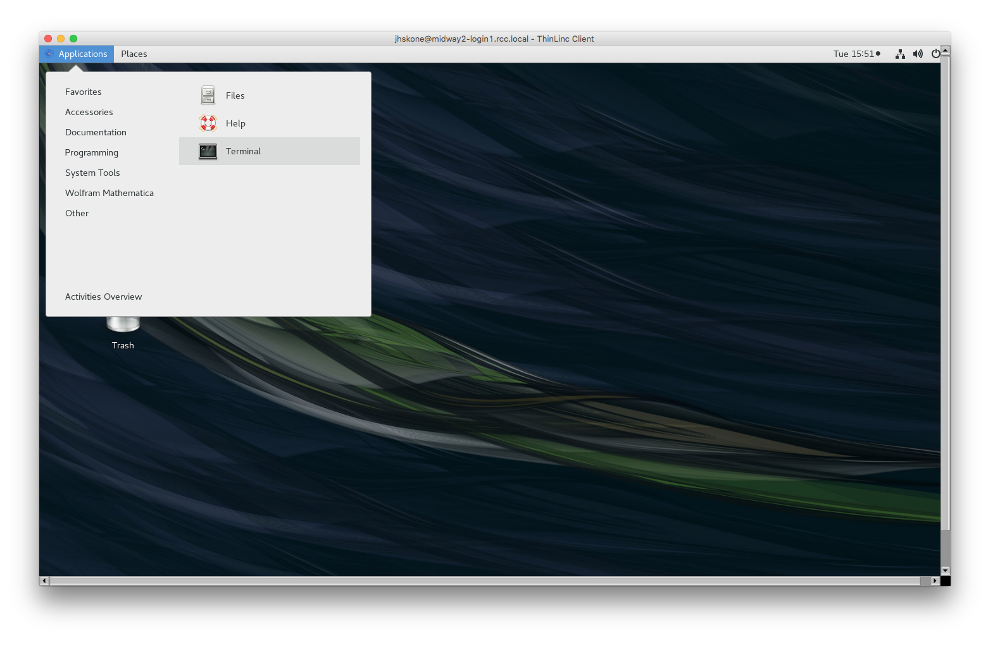
	</p>

===+ "Midway3, Midway3-AMD, Beagle3"
	Upon successfully logging in via ThinLinc, you will be connected to a login node and presented with a desktop interface. Select the `Applications` tab in the top left corner to access the terminal, file browser, and other utilities.
	<p align="center">
	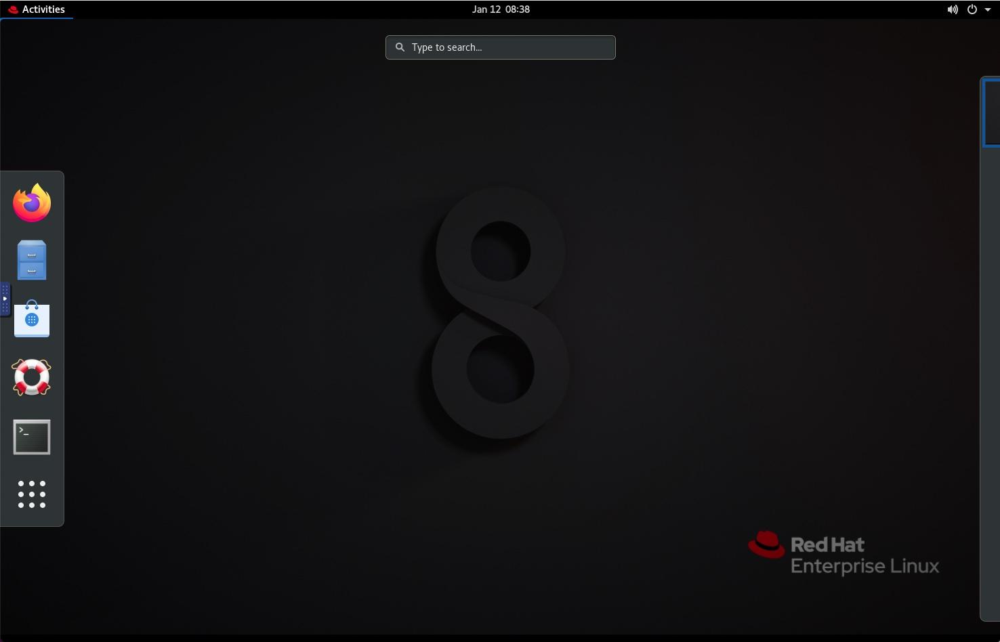
	</p>
	To view all available applications, click the 3x3 dot grid at the bottom of the `Activities` Tab:
	<p align="center">
	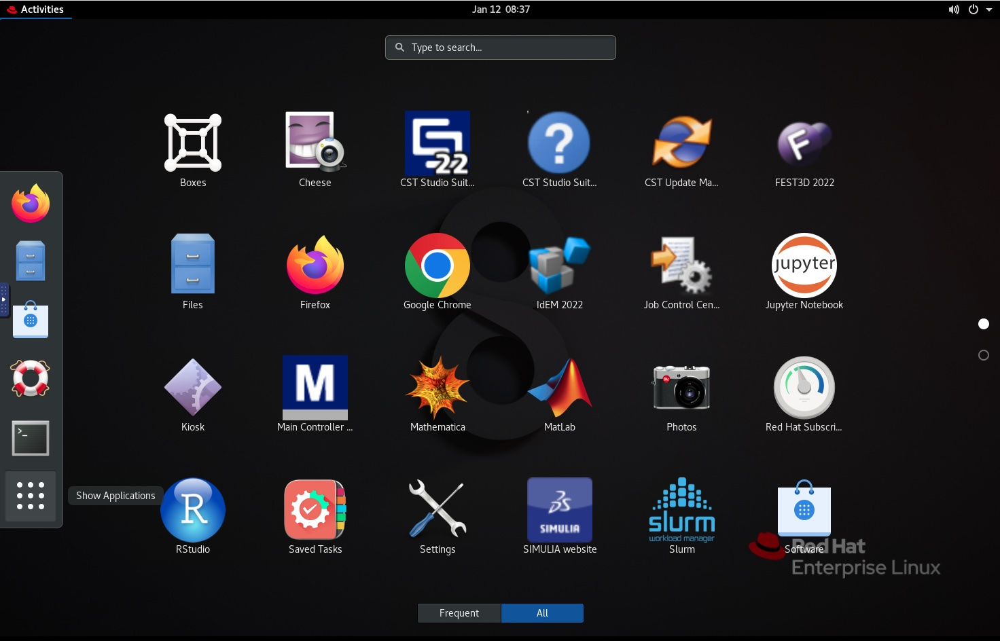
	</p>	


===+ "MidwaySSD"
	Upon successfully logging in via ThinLinc, you will be connected to a login node and presented with a desktop interface. 
	 <p align="center">
    
    </p> 
	Select the `Applications` tab in the top left corner to access the terminal, file browser, and other utilities.
    <p align="center">
    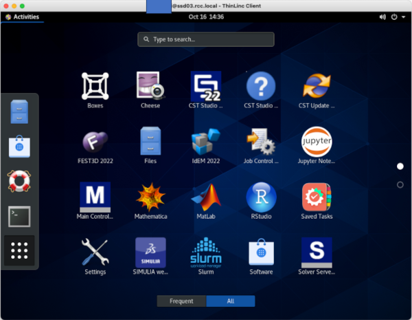
    </p> 
	To open a terminal, type in `terminal`: 
    <p align="center">
    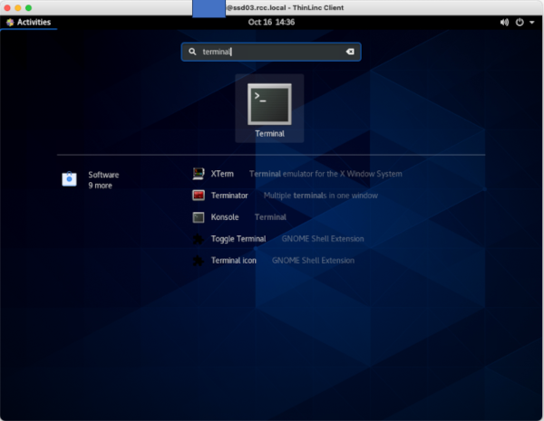
    </p> 
    Then, press `enter`: 
    <p align="center">
    
    </p>
    For an interactive session, type in your required `sinteractive` setting: 
    <p align="center">
    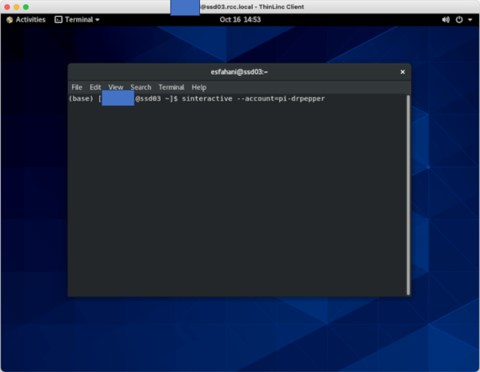
    </p>
    Then, press `enter`: 
    <p align="center">
    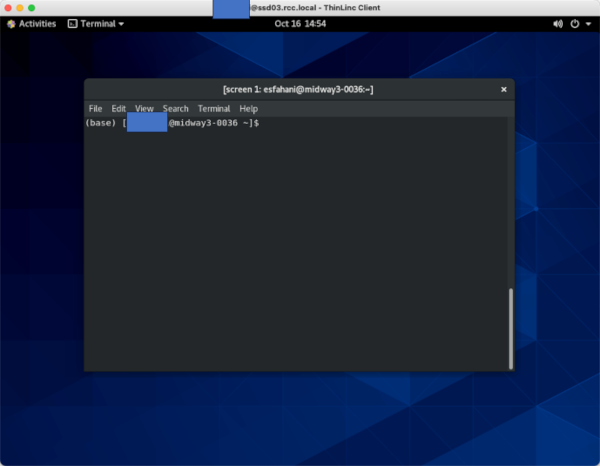
    </p>
    After this step, you'll land on a compute node. 
    
To copy/paste text between your computer and ThinLinc (when copying code into the Terminal, for example), open the side toolbar by clicking the small blue handle. Click the Clipboard icon. The text field that just opened will be synced with the clipboard on the server so you can copy and paste to and from this text field. 

<p align="center">
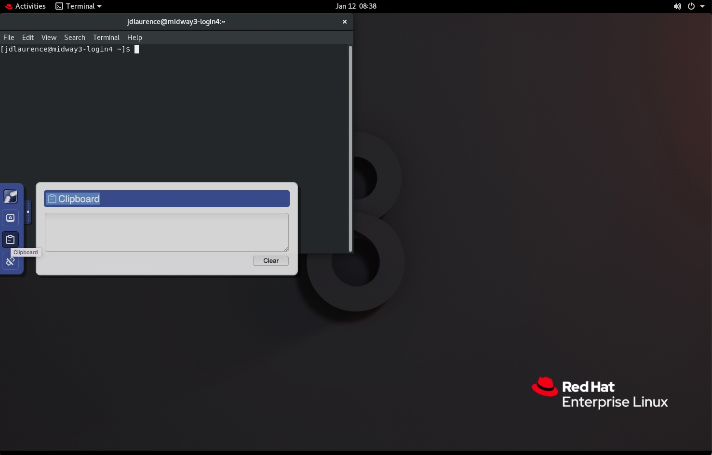
</p>	

With ThinLinc, you can maintain an active session after you have closed your connection to RCC clusters. To disconnect from Midway but maintain an active session, simply close the ThinLinc window. **You must have "End existing session" unchecked for this to occur.**

To exit ThinLinc and terminate your session completely, simply exit or close the ThinLinc application.

## Remote Visualization on Midway2

RCC provides a mechanism for accessing a GPU-equipped visualization node, which can be used for running 3D and graphics-intensive visualization software packages. 

First, log into Midway2 via ThinLinc.

Once logged in, open a terminal, and in the terminal window, issue the command `sviz`. This will take you to the visualization node. 

To exit the visualization node, simply close the terminal window from which it was launched. You can then log out of Midway2 by selecting Logout from the `Applications` menu in ThinLinc or simply closing the ThinLinc window. 

## Common mistakes using ThinLinc
Once you have connected to RCC clusters through ThinLinc (see [Accessing RCC resources](connecting.md)), you land on one of the login nodes. Login nodes may be used for compiling and debugging code, installing software, editing and managing files, submitting jobs, or any other work that is *not* long-running or computationally intensive. *Login nodes should never be used for computationally intensive work.*

All intensive computations should be performed on compute nodes. If you are unsure whether your computations will be intensive, please [request an interactive session](slurm-sinteractive.md) and continue your work once connected to the compute node.

!!! warning
    Running computationally intensive jobs on the login nodes prevents other users from efficiently using the cluster. RCC System Administrators may terminate your processes without warning if your processes disrupt other users’ work on the RCC cluster. 

